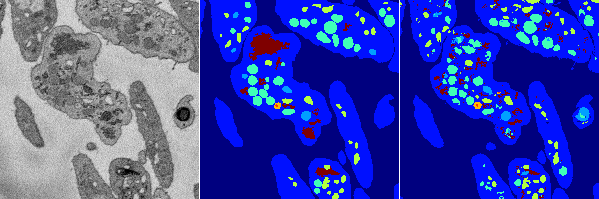
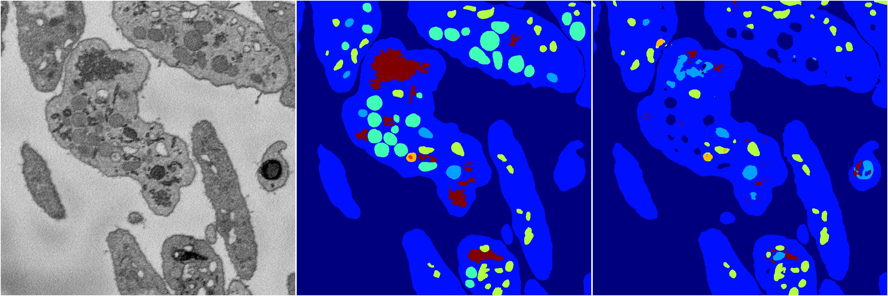
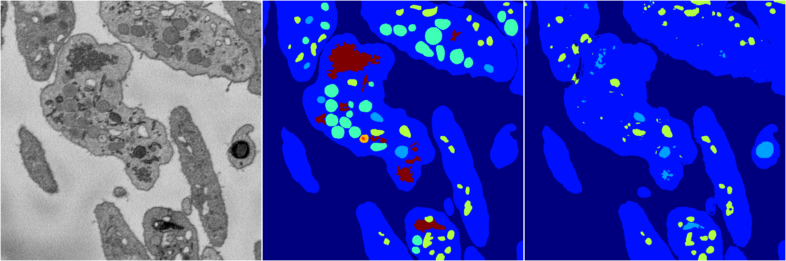
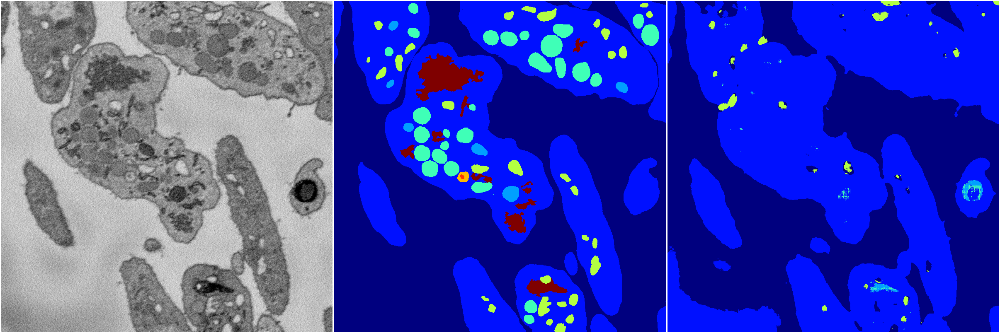

[Back](..)&nbsp;&nbsp;&nbsp;&nbsp;&nbsp;[Home](https://leapmanlab.github.io/snapshots)

---

<a href="4"><h2>random_2d_ed / 1216 / 80 / 4</h2></a>
Created 21 Dec 2018, 14:17:45

<i>Click for more details</i>

**ari**: 0.7912. **miou**: 0.5385. **accuracy**: 0.9080. **n_params**: 5283596.0000. 

---

<a href="3"><h2>random_2d_ed / 1216 / 80 / 3</h2></a>
Created 21 Dec 2018, 14:17:45

<i>Click for more details</i>

**ari**: 0.7769. **miou**: 0.4051. **accuracy**: 0.9042. **n_params**: 5283596.0000. 

---

<a href="2"><h2>random_2d_ed / 1216 / 80 / 2</h2></a>
Created 21 Dec 2018, 14:17:45

<i>Click for more details</i>

**ari**: 0.7400. **miou**: 0.3280. **accuracy**: 0.8935. **n_params**: 5283596.0000. 

---

<a href="1"><h2>random_2d_ed / 1216 / 80 / 1</h2></a>
Created 21 Dec 2018, 14:17:45

<i>Click for more details</i>

**ari**: 0.6350. **miou**: 0.2290. **accuracy**: 0.8604. **n_params**: 5283596.0000. 

---

<a href="0"><h2>random_2d_ed / 1216 / 80 / 0</h2></a>
Created 21 Dec 2018, 14:17:45

<i>Click for more details</i>

**ari**: 0.8069. **miou**: 0.5432. **accuracy**: 0.9206. **n_params**: 5283596.0000. 

---

[Back](..)&nbsp;&nbsp;&nbsp;&nbsp;&nbsp;[Home](https://leapmanlab.github.io/snapshots)

---