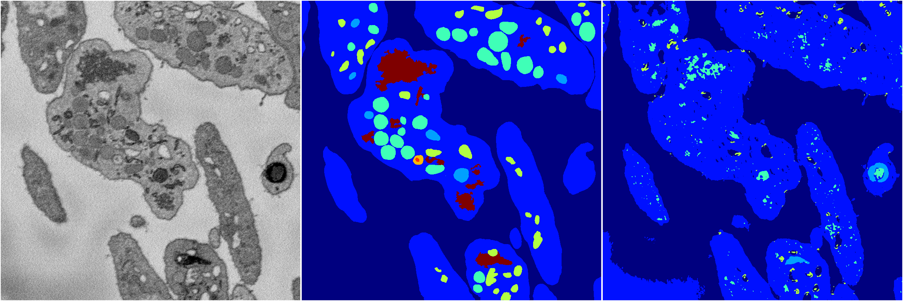
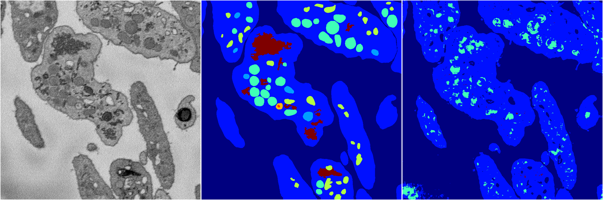
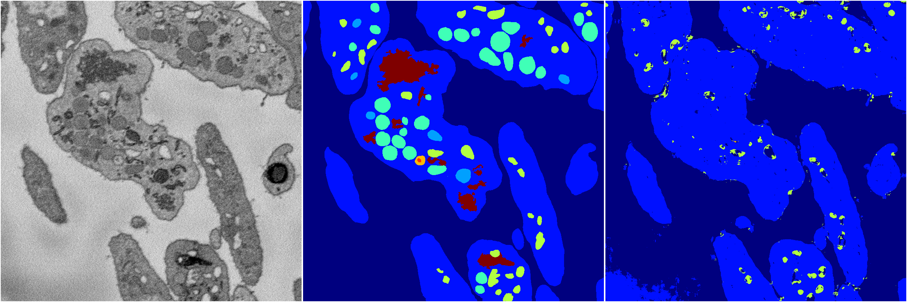

[Back](..)&nbsp;&nbsp;&nbsp;&nbsp;&nbsp;[Home](https://leapmanlab.github.io/snapshots)

---

<a href="4"><h2>random_2d_ed / 1216 / 81 / 4</h2></a>
Created 21 Dec 2018, 14:17:45

<i>Click for more details</i>

**ari**: 0.6362. **miou**: 0.2260. **accuracy**: 0.8332. **n_params**: 699416.0000. 

---

<a href="3"><h2>random_2d_ed / 1216 / 81 / 3</h2></a>
Created 21 Dec 2018, 14:17:45

<i>Click for more details</i>

**ari**: 0.5978. **miou**: 0.2088. **accuracy**: 0.8351. **n_params**: 699416.0000. 

---

<a href="2"><h2>random_2d_ed / 1216 / 81 / 2</h2></a>
Created 21 Dec 2018, 14:17:45

<i>Click for more details</i>

**ari**: 0.6539. **miou**: 0.2635. **accuracy**: 0.8515. **n_params**: 699416.0000. 

---

<a href="1"><h2>random_2d_ed / 1216 / 81 / 1</h2></a>
Created 21 Dec 2018, 14:17:45

<i>Click for more details</i>

**ari**: 0.6753. **miou**: 0.2352. **accuracy**: 0.8470. **n_params**: 699416.0000. 

---

<a href="0"><h2>random_2d_ed / 1216 / 81 / 0</h2></a>
Created 21 Dec 2018, 14:17:45

<i>Click for more details</i>

**ari**: 0.6423. **miou**: 0.2553. **accuracy**: 0.8491. **n_params**: 699416.0000. 

---

[Back](..)&nbsp;&nbsp;&nbsp;&nbsp;&nbsp;[Home](https://leapmanlab.github.io/snapshots)

---