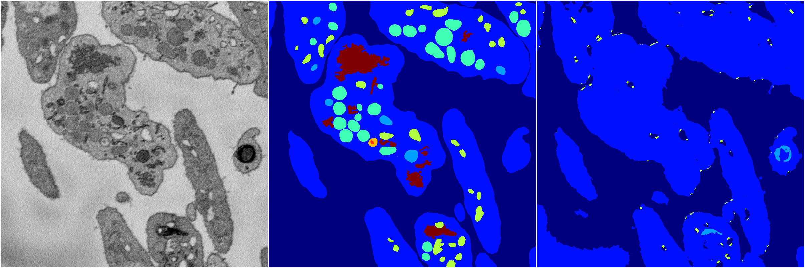
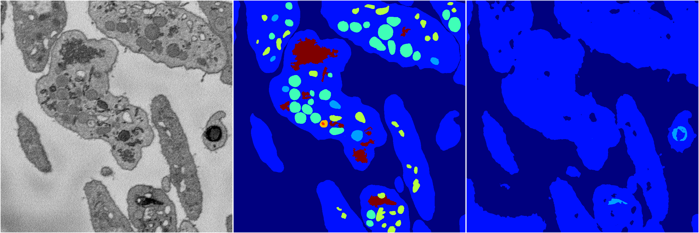
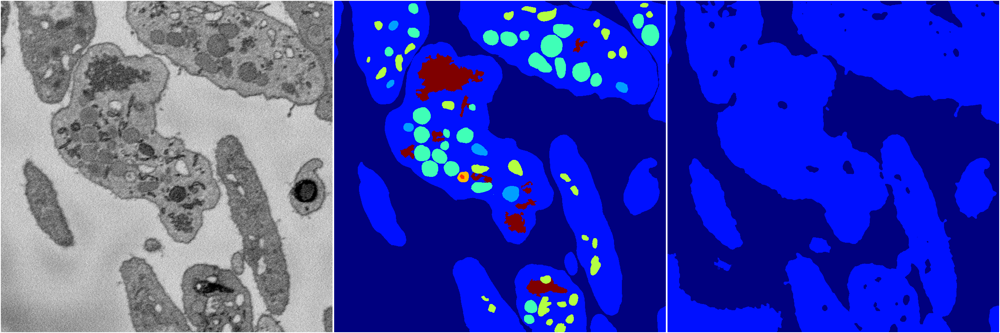

[Back](..)&nbsp;&nbsp;&nbsp;&nbsp;&nbsp;[Home](https://leapmanlab.github.io/snapshots)

---

<a href="4"><h2>random_2d_ed / 1216 / 82 / 4</h2></a>
Created 21 Dec 2018, 14:17:45

<i>Click for more details</i>

**ari**: 0.7396. **miou**: 0.4159. **accuracy**: 0.8779. **n_params**: 428441.0000. 

---

<a href="3"><h2>random_2d_ed / 1216 / 82 / 3</h2></a>
Created 21 Dec 2018, 14:17:45

<i>Click for more details</i>

**ari**: 0.6021. **miou**: 0.2143. **accuracy**: 0.8377. **n_params**: 428441.0000. 

---

<a href="2"><h2>random_2d_ed / 1216 / 82 / 2</h2></a>
Created 21 Dec 2018, 14:17:45

<i>Click for more details</i>

**ari**: 0.6044. **miou**: 0.2038. **accuracy**: 0.8382. **n_params**: 428441.0000. 

---

<a href="1"><h2>random_2d_ed / 1216 / 82 / 1</h2></a>
Created 21 Dec 2018, 14:17:45

<i>Click for more details</i>

**ari**: 0.5967. **miou**: 0.2019. **accuracy**: 0.8364. **n_params**: 428441.0000. 

---

<a href="0"><h2>random_2d_ed / 1216 / 82 / 0</h2></a>
Created 21 Dec 2018, 14:17:45

<i>Click for more details</i>

**ari**: 0.6268. **miou**: 0.2229. **accuracy**: 0.8449. **n_params**: 428441.0000. 

---

[Back](..)&nbsp;&nbsp;&nbsp;&nbsp;&nbsp;[Home](https://leapmanlab.github.io/snapshots)

---