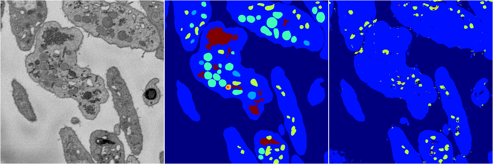
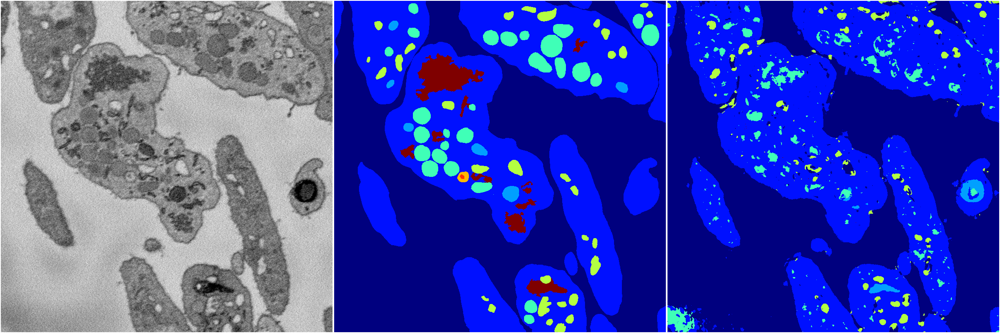
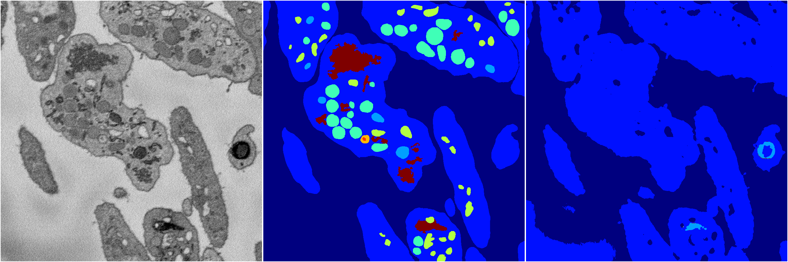
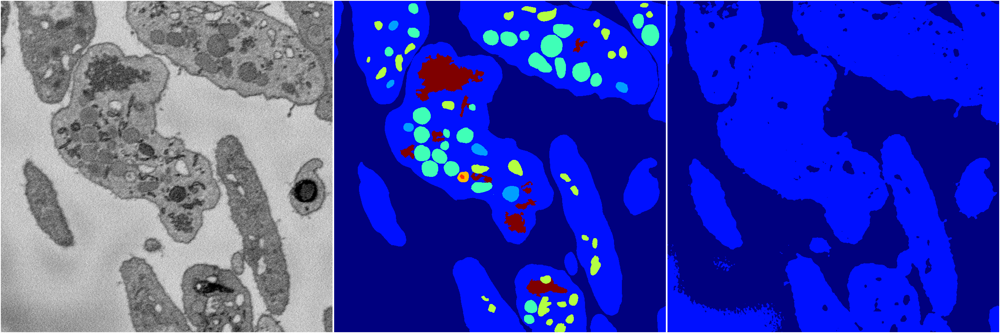

[Back](..)&nbsp;&nbsp;&nbsp;&nbsp;&nbsp;[Home](https://leapmanlab.github.io/snapshots)

---

<a href="4"><h2>random_2d_ed / 1216 / 83 / 4</h2></a>
Created 17 Dec 2018, 23:35:15

<i>Click for more details</i>

**ari**: 0.6640. **miou**: 0.2874. **accuracy**: 0.8564. **n_params**: 139843.0000. 

---

<a href="3"><h2>random_2d_ed / 1216 / 83 / 3</h2></a>
Created 17 Dec 2018, 23:35:15

<i>Click for more details</i>

**ari**: 0.7261. **miou**: 0.3950. **accuracy**: 0.8729. **n_params**: 139843.0000. 

---

<a href="2"><h2>random_2d_ed / 1216 / 83 / 2</h2></a>
Created 17 Dec 2018, 23:35:15

<i>Click for more details</i>

**ari**: 0.6829. **miou**: 0.2901. **accuracy**: 0.8530. **n_params**: 139843.0000. 

---

<a href="1"><h2>random_2d_ed / 1216 / 83 / 1</h2></a>
Created 17 Dec 2018, 23:35:15

<i>Click for more details</i>

**ari**: 0.6091. **miou**: 0.2051. **accuracy**: 0.8376. **n_params**: 139843.0000. 

---

<a href="0"><h2>random_2d_ed / 1216 / 83 / 0</h2></a>
Created 17 Dec 2018, 23:35:15

<i>Click for more details</i>

**ari**: 0.5870. **miou**: 0.2005. **accuracy**: 0.8326. **n_params**: 139843.0000. 

---

[Back](..)&nbsp;&nbsp;&nbsp;&nbsp;&nbsp;[Home](https://leapmanlab.github.io/snapshots)

---