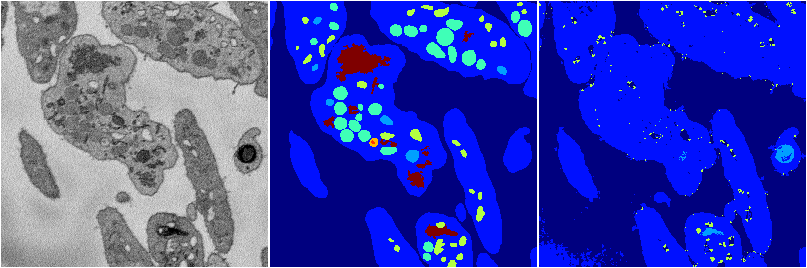
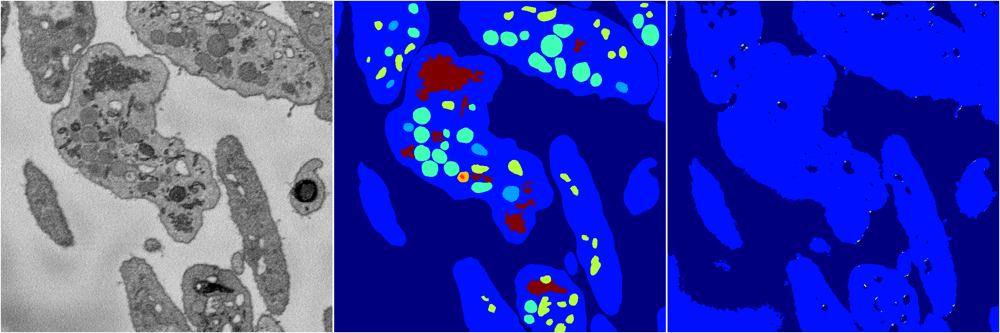
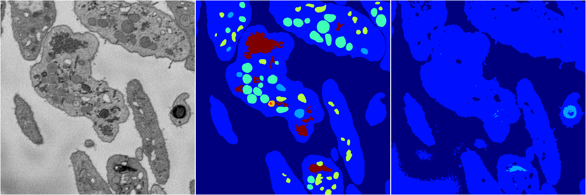

[Back](..)&nbsp;&nbsp;&nbsp;&nbsp;&nbsp;[Home](https://leapmanlab.github.io/snapshots)

---

<a href="4"><h2>random_2d_ed / 1216 / 84 / 4</h2></a>
Created 21 Dec 2018, 14:17:45

<i>Click for more details</i>

**ari**: 0.6212. **miou**: 0.2358. **accuracy**: 0.8405. **n_params**: 207581.0000. 

---

<a href="3"><h2>random_2d_ed / 1216 / 84 / 3</h2></a>
Created 21 Dec 2018, 14:17:45

<i>Click for more details</i>

**ari**: 0.5995. **miou**: 0.2036. **accuracy**: 0.8352. **n_params**: 207581.0000. 

---

<a href="2"><h2>random_2d_ed / 1216 / 84 / 2</h2></a>
Created 21 Dec 2018, 14:17:45

<i>Click for more details</i>

**ari**: 0.5857. **miou**: 0.2007. **accuracy**: 0.8319. **n_params**: 207581.0000. 

---

<a href="1"><h2>random_2d_ed / 1216 / 84 / 1</h2></a>
Created 21 Dec 2018, 14:17:45

<i>Click for more details</i>

**ari**: 0.5780. **miou**: 0.2140. **accuracy**: 0.8282. **n_params**: 207581.0000. 

---

<a href="0"><h2>random_2d_ed / 1216 / 84 / 0</h2></a>
Created 21 Dec 2018, 14:17:45

<i>Click for more details</i>

**ari**: 0.6173. **miou**: 0.2564. **accuracy**: 0.8132. **n_params**: 207581.0000. 

---

[Back](..)&nbsp;&nbsp;&nbsp;&nbsp;&nbsp;[Home](https://leapmanlab.github.io/snapshots)

---