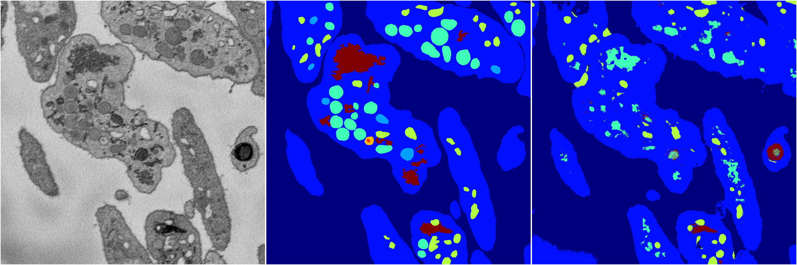
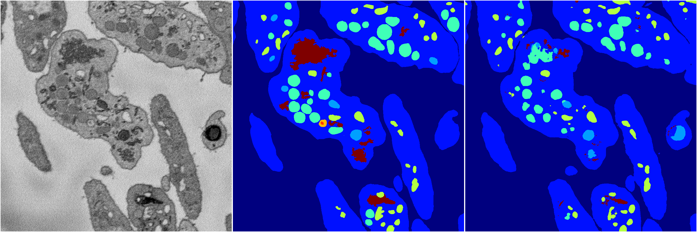
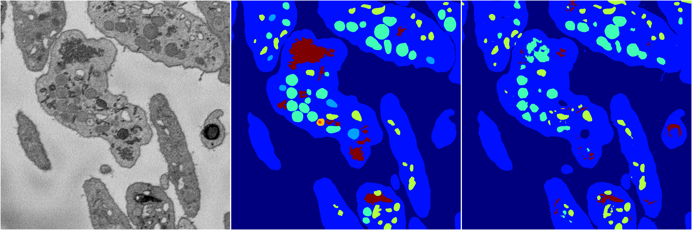

[Back](..)&nbsp;&nbsp;&nbsp;&nbsp;&nbsp;[Home](https://leapmanlab.github.io/snapshots)

---

<a href="4"><h2>random_2d_ed / 1216 / 85 / 4</h2></a>
Created 17 Dec 2018, 23:35:15

<i>Click for more details</i>

**ari**: 0.7009. **miou**: 0.2935. **accuracy**: 0.8658. **n_params**: 8768049.0000. 

---

<a href="3"><h2>random_2d_ed / 1216 / 85 / 3</h2></a>
Created 17 Dec 2018, 23:35:15

<i>Click for more details</i>

**ari**: 0.6962. **miou**: 0.2645. **accuracy**: 0.8727. **n_params**: 8768049.0000. 

---

<a href="1"><h2>random_2d_ed / 1216 / 85 / 1</h2></a>
Created 17 Dec 2018, 23:35:15

<i>Click for more details</i>

**ari**: 0.8017. **miou**: 0.4871. **accuracy**: 0.9119. **n_params**: 8768049.0000. 

---

<a href="2"><h2>random_2d_ed / 1216 / 85 / 2</h2></a>
Created 17 Dec 2018, 23:35:15

<i>Click for more details</i>

**ari**: 0.7970. **miou**: 0.4837. **accuracy**: 0.9101. **n_params**: 8768049.0000. 

---

<a href="0"><h2>random_2d_ed / 1216 / 85 / 0</h2></a>
Created 17 Dec 2018, 23:35:15

<i>Click for more details</i>

**ari**: 0.7783. **miou**: 0.4421. **accuracy**: 0.9033. **n_params**: 8768049.0000. 

---

[Back](..)&nbsp;&nbsp;&nbsp;&nbsp;&nbsp;[Home](https://leapmanlab.github.io/snapshots)

---