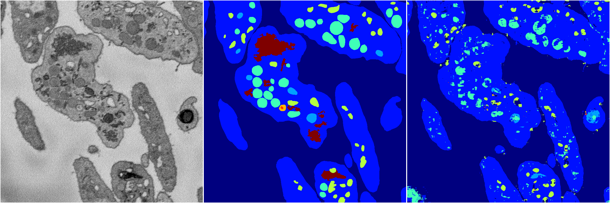
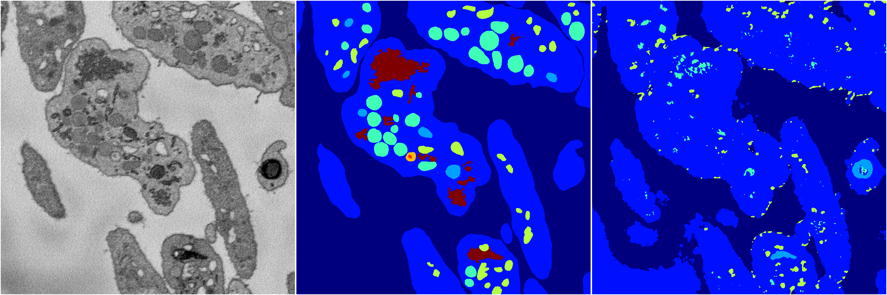
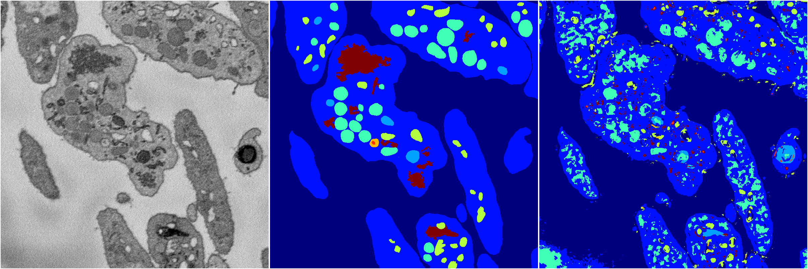

[Back](..)&nbsp;&nbsp;&nbsp;&nbsp;&nbsp;[Home](https://leapmanlab.github.io/snapshots)

---

<a href="4"><h2>random_2d_ed / 1216 / 86 / 4</h2></a>
Created 17 Dec 2018, 23:35:15

<i>Click for more details</i>

**ari**: 0.7215. **miou**: 0.3778. **accuracy**: 0.8692. **n_params**: 752535.0000. 

---

<a href="3"><h2>random_2d_ed / 1216 / 86 / 3</h2></a>
Created 17 Dec 2018, 23:35:15

<i>Click for more details</i>

**ari**: 0.7067. **miou**: 0.3173. **accuracy**: 0.8629. **n_params**: 752535.0000. 

---

<a href="2"><h2>random_2d_ed / 1216 / 86 / 2</h2></a>
Created 17 Dec 2018, 23:35:15

<i>Click for more details</i>

**ari**: 0.4830. **miou**: 0.2242. **accuracy**: 0.7920. **n_params**: 752535.0000. 

---

<a href="1"><h2>random_2d_ed / 1216 / 86 / 1</h2></a>
Created 17 Dec 2018, 23:35:15

<i>Click for more details</i>

**ari**: 0.6496. **miou**: 0.3340. **accuracy**: 0.8254. **n_params**: 752535.0000. 

---

<a href="0"><h2>random_2d_ed / 1216 / 86 / 0</h2></a>
Created 17 Dec 2018, 23:35:15

<i>Click for more details</i>

**ari**: 0.7050. **miou**: 0.3783. **accuracy**: 0.8574. **n_params**: 752535.0000. 

---

[Back](..)&nbsp;&nbsp;&nbsp;&nbsp;&nbsp;[Home](https://leapmanlab.github.io/snapshots)

---