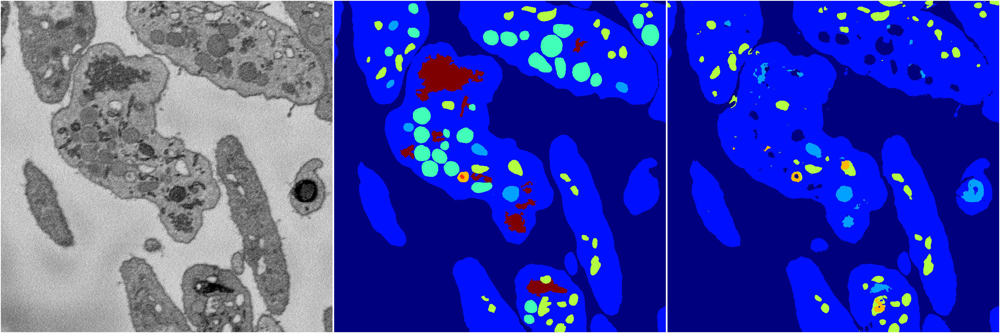
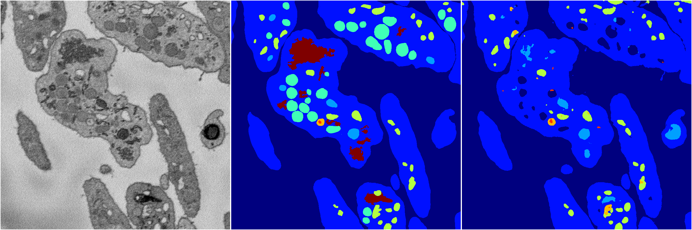

[Back](..)&nbsp;&nbsp;&nbsp;&nbsp;&nbsp;[Home](https://leapmanlab.github.io/snapshots)

---

<a href="0"><h2>random_2d_ed / 1216 / 87 / 0</h2></a>
Created 21 Dec 2018, 01:15:55

<i>Click for more details</i>

**ari**: 0.8015. **miou**: 0.5089. **accuracy**: 0.9069. **n_params**: 3586068.0000. 

---

<a href="3"><h2>random_2d_ed / 1216 / 87 / 3</h2></a>
Created 21 Dec 2018, 01:15:55

<i>Click for more details</i>

**ari**: 0.7626. **miou**: 0.3920. **accuracy**: 0.8984. **n_params**: 3586068.0000. 

---

<a href="1"><h2>random_2d_ed / 1216 / 87 / 1</h2></a>
Created 21 Dec 2018, 01:15:55

<i>Click for more details</i>

**ari**: 0.7766. **miou**: 0.3681. **accuracy**: 0.9007. **n_params**: 3586068.0000. 

---

<a href="4"><h2>random_2d_ed / 1216 / 87 / 4</h2></a>
Created 21 Dec 2018, 01:15:55

<i>Click for more details</i>

**ari**: 0.8199. **miou**: 0.4620. **accuracy**: 0.9220. **n_params**: 3586068.0000. 

---

<a href="2"><h2>random_2d_ed / 1216 / 87 / 2</h2></a>
Created 21 Dec 2018, 01:15:55

<i>Click for more details</i>

**ari**: 0.7840. **miou**: 0.4118. **accuracy**: 0.9040. **n_params**: 3586068.0000. 

---

[Back](..)&nbsp;&nbsp;&nbsp;&nbsp;&nbsp;[Home](https://leapmanlab.github.io/snapshots)

---