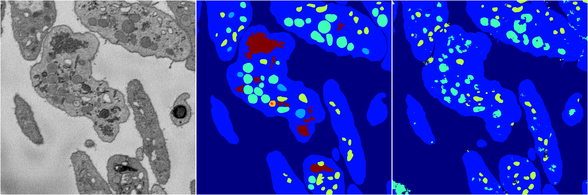
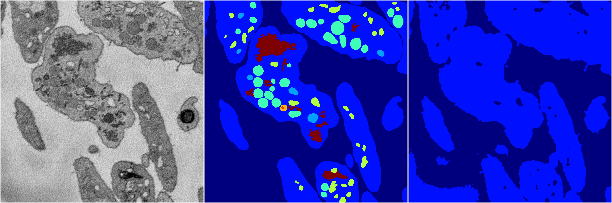
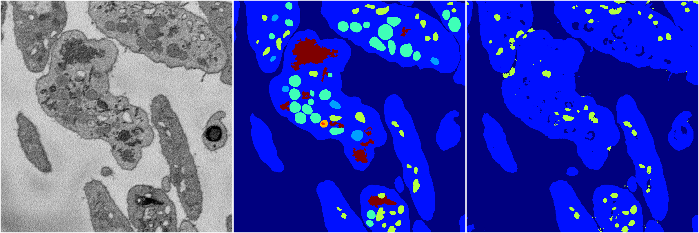

[Back](..)&nbsp;&nbsp;&nbsp;&nbsp;&nbsp;[Home](https://leapmanlab.github.io/snapshots)

---

<a href="0"><h2>random_2d_ed / 1216 / 88 / 0</h2></a>
Created 21 Dec 2018, 01:15:55

<i>Click for more details</i>

**ari**: 0.7441. **miou**: 0.3281. **accuracy**: 0.8789. **n_params**: 88439.0000. 

---

<a href="3"><h2>random_2d_ed / 1216 / 88 / 3</h2></a>
Created 21 Dec 2018, 01:15:55

<i>Click for more details</i>

**ari**: 0.5794. **miou**: 0.1997. **accuracy**: 0.8323. **n_params**: 88439.0000. 

---

<a href="1"><h2>random_2d_ed / 1216 / 88 / 1</h2></a>
Created 21 Dec 2018, 01:15:55

<i>Click for more details</i>

**ari**: 0.6047. **miou**: 0.2025. **accuracy**: 0.8391. **n_params**: 88439.0000. 

---

<a href="4"><h2>random_2d_ed / 1216 / 88 / 4</h2></a>
Created 21 Dec 2018, 01:15:55

<i>Click for more details</i>

**ari**: 0.6958. **miou**: 0.2786. **accuracy**: 0.8675. **n_params**: 88439.0000. 

---

<a href="2"><h2>random_2d_ed / 1216 / 88 / 2</h2></a>
Created 21 Dec 2018, 01:15:55

<i>Click for more details</i>

**ari**: 0.7543. **miou**: 0.4263. **accuracy**: 0.8866. **n_params**: 88439.0000. 

---

[Back](..)&nbsp;&nbsp;&nbsp;&nbsp;&nbsp;[Home](https://leapmanlab.github.io/snapshots)

---