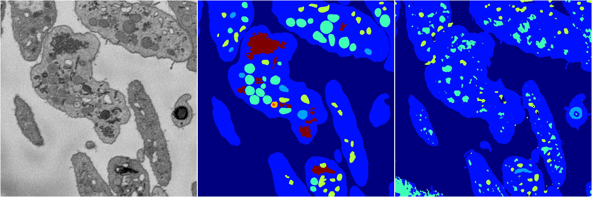
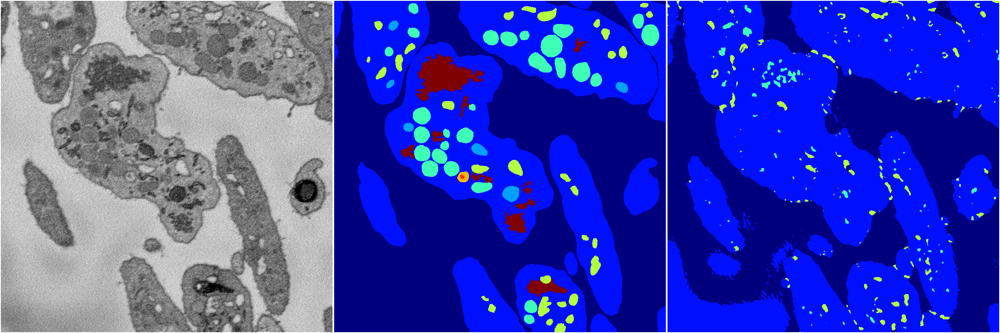
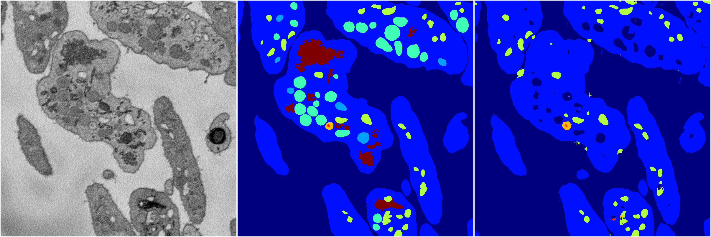
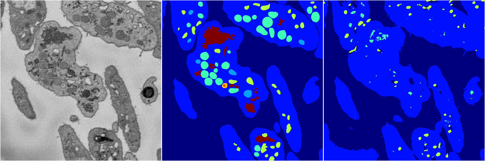

[Back](..)&nbsp;&nbsp;&nbsp;&nbsp;&nbsp;[Home](https://leapmanlab.github.io/snapshots)

---

<a href="0"><h2>random_2d_ed / 1216 / 89 / 0</h2></a>
Created 21 Dec 2018, 01:15:55

<i>Click for more details</i>

**ari**: 0.7822. **miou**: 0.4726. **accuracy**: 0.9017. **n_params**: 2514958.0000. 

---

<a href="3"><h2>random_2d_ed / 1216 / 89 / 3</h2></a>
Created 21 Dec 2018, 01:15:55

<i>Click for more details</i>

**ari**: 0.6848. **miou**: 0.2903. **accuracy**: 0.8565. **n_params**: 2514958.0000. 

---

<a href="1"><h2>random_2d_ed / 1216 / 89 / 1</h2></a>
Created 21 Dec 2018, 01:15:55

<i>Click for more details</i>

**ari**: 0.4647. **miou**: 0.2168. **accuracy**: 0.7911. **n_params**: 2514958.0000. 

---

<a href="4"><h2>random_2d_ed / 1216 / 89 / 4</h2></a>
Created 21 Dec 2018, 01:15:55

<i>Click for more details</i>

**ari**: 0.7152. **miou**: 0.3657. **accuracy**: 0.8744. **n_params**: 2514958.0000. 

---

<a href="2"><h2>random_2d_ed / 1216 / 89 / 2</h2></a>
Created 21 Dec 2018, 01:15:55

<i>Click for more details</i>

**ari**: 0.6483. **miou**: 0.2430. **accuracy**: 0.8482. **n_params**: 2514958.0000. 

---

[Back](..)&nbsp;&nbsp;&nbsp;&nbsp;&nbsp;[Home](https://leapmanlab.github.io/snapshots)

---