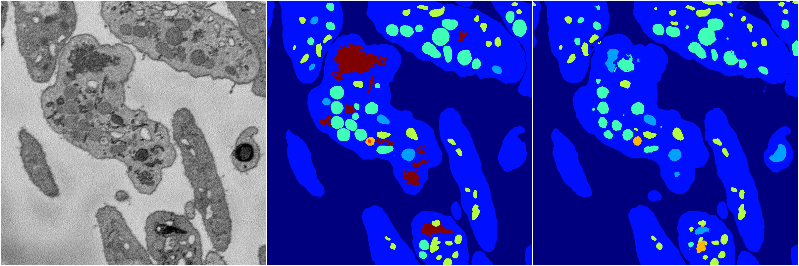
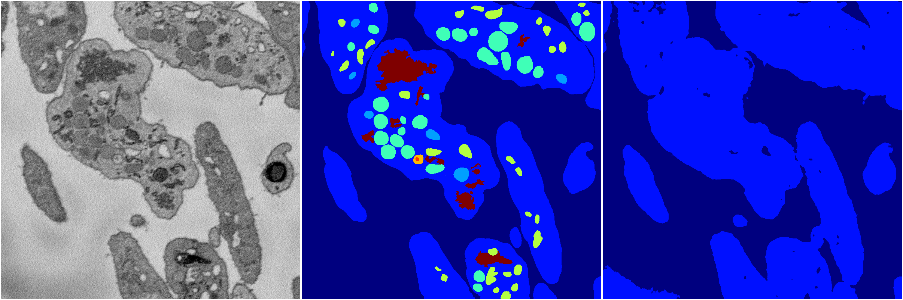
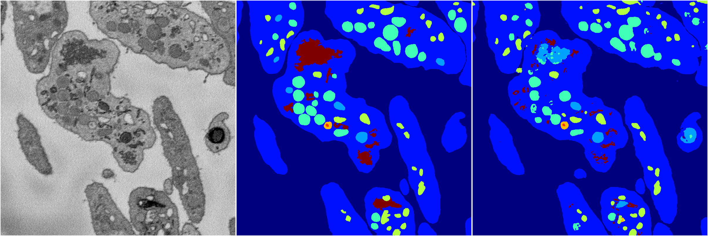
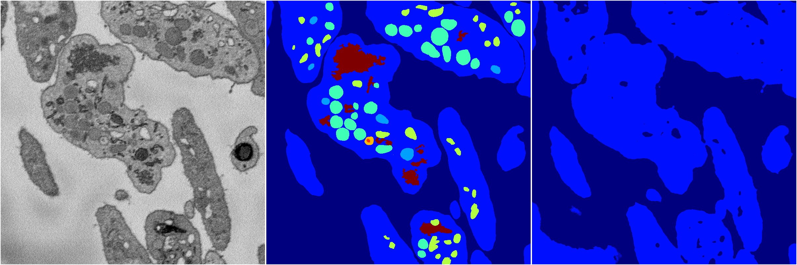

[Back](..)&nbsp;&nbsp;&nbsp;&nbsp;&nbsp;[Home](https://leapmanlab.github.io/snapshots)

---

<a href="0"><h2>random_2d_ed / 1216 / 90 / 0</h2></a>
Created 21 Dec 2018, 01:15:55

<i>Click for more details</i>

**ari**: 0.8170. **miou**: 0.5318. **accuracy**: 0.9217. **n_params**: 2045334.0000. 

---

<a href="3"><h2>random_2d_ed / 1216 / 90 / 3</h2></a>
Created 21 Dec 2018, 01:15:55

<i>Click for more details</i>

**ari**: 0.8106. **miou**: 0.4530. **accuracy**: 0.9210. **n_params**: 2045334.0000. 

---

<a href="1"><h2>random_2d_ed / 1216 / 90 / 1</h2></a>
Created 21 Dec 2018, 01:15:55

<i>Click for more details</i>

**ari**: 0.6553. **miou**: 0.2091. **accuracy**: 0.8712. **n_params**: 2045334.0000. 

---

<a href="4"><h2>random_2d_ed / 1216 / 90 / 4</h2></a>
Created 21 Dec 2018, 01:15:55

<i>Click for more details</i>

**ari**: 0.8177. **miou**: 0.5286. **accuracy**: 0.9221. **n_params**: 2045334.0000. 

---

<a href="2"><h2>random_2d_ed / 1216 / 90 / 2</h2></a>
Created 21 Dec 2018, 01:15:55

<i>Click for more details</i>

**ari**: 0.6362. **miou**: 0.2058. **accuracy**: 0.8641. **n_params**: 2045334.0000. 

---

[Back](..)&nbsp;&nbsp;&nbsp;&nbsp;&nbsp;[Home](https://leapmanlab.github.io/snapshots)

---