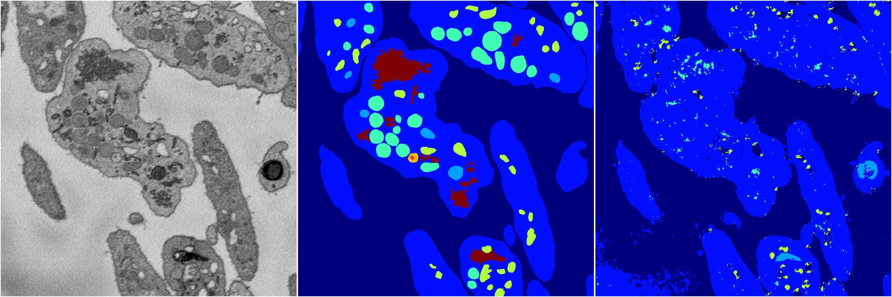
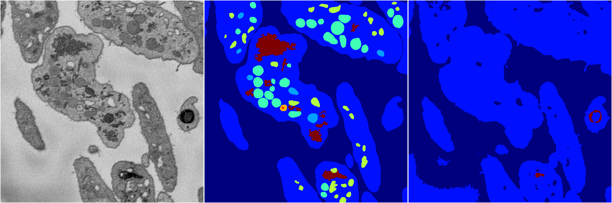
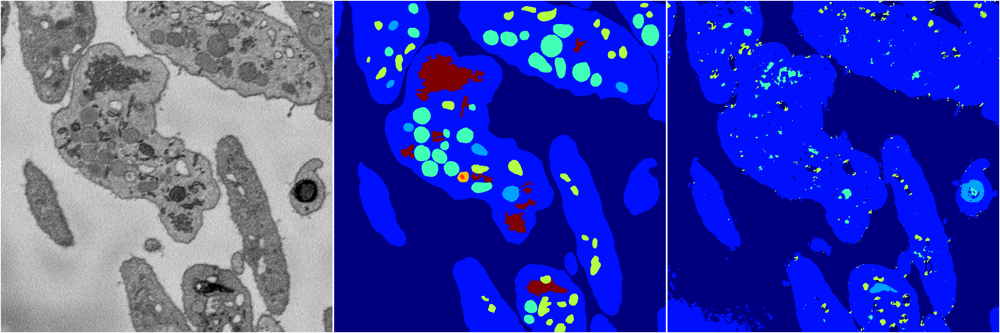

[Back](..)&nbsp;&nbsp;&nbsp;&nbsp;&nbsp;[Home](https://leapmanlab.github.io/snapshots)

---

<a href="4"><h2>random_2d_ed / 1216 / 91 / 4</h2></a>
Created 17 Dec 2018, 23:35:14

<i>Click for more details</i>

**ari**: 0.6439. **miou**: 0.2395. **accuracy**: 0.8420. **n_params**: 230746.0000. 

---

<a href="3"><h2>random_2d_ed / 1216 / 91 / 3</h2></a>
Created 17 Dec 2018, 23:35:14

<i>Click for more details</i>

**ari**: 0.6307. **miou**: 0.2408. **accuracy**: 0.8407. **n_params**: 230746.0000. 

---

<a href="2"><h2>random_2d_ed / 1216 / 91 / 2</h2></a>
Created 17 Dec 2018, 23:35:14

<i>Click for more details</i>

**ari**: 0.5867. **miou**: 0.2015. **accuracy**: 0.8322. **n_params**: 230746.0000. 

---

<a href="0"><h2>random_2d_ed / 1216 / 91 / 0</h2></a>
Created 17 Dec 2018, 23:35:14

<i>Click for more details</i>

**ari**: 0.6414. **miou**: 0.2374. **accuracy**: 0.8412. **n_params**: 230746.0000. 

---

<a href="1"><h2>random_2d_ed / 1216 / 91 / 1</h2></a>
Created 17 Dec 2018, 23:35:14

<i>Click for more details</i>

**ari**: 0.6473. **miou**: 0.2587. **accuracy**: 0.8388. **n_params**: 230746.0000. 

---

[Back](..)&nbsp;&nbsp;&nbsp;&nbsp;&nbsp;[Home](https://leapmanlab.github.io/snapshots)

---