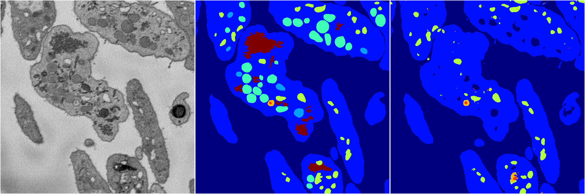
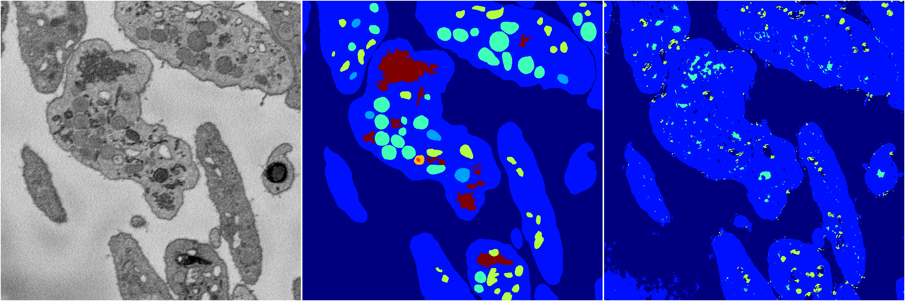
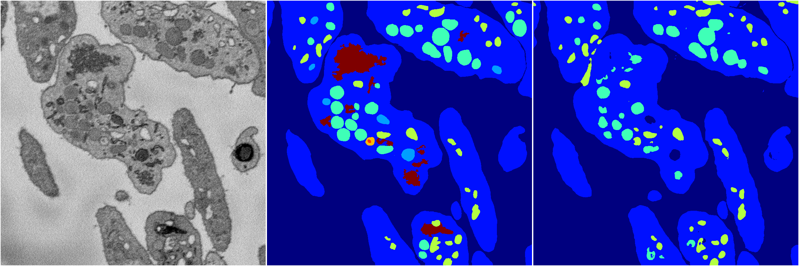
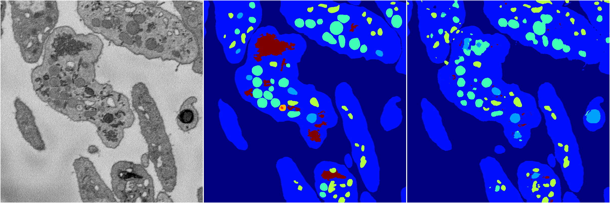

[Back](..)&nbsp;&nbsp;&nbsp;&nbsp;&nbsp;[Home](https://leapmanlab.github.io/snapshots)

---

<a href="4"><h2>random_2d_ed / 1216 / 92 / 4</h2></a>
Created 17 Dec 2018, 23:35:16

<i>Click for more details</i>

**ari**: 0.7254. **miou**: 0.3511. **accuracy**: 0.8841. **n_params**: 8234535.0000. 

---

<a href="3"><h2>random_2d_ed / 1216 / 92 / 3</h2></a>
Created 17 Dec 2018, 23:35:16

<i>Click for more details</i>

**ari**: 0.7803. **miou**: 0.4502. **accuracy**: 0.9023. **n_params**: 8234535.0000. 

---

<a href="2"><h2>random_2d_ed / 1216 / 92 / 2</h2></a>
Created 17 Dec 2018, 23:35:16

<i>Click for more details</i>

**ari**: 0.6537. **miou**: 0.2460. **accuracy**: 0.8579. **n_params**: 8234535.0000. 

---

<a href="0"><h2>random_2d_ed / 1216 / 92 / 0</h2></a>
Created 17 Dec 2018, 23:35:16

<i>Click for more details</i>

**ari**: 0.7802. **miou**: 0.3564. **accuracy**: 0.9048. **n_params**: 8234535.0000. 

---

<a href="1"><h2>random_2d_ed / 1216 / 92 / 1</h2></a>
Created 17 Dec 2018, 23:35:16

<i>Click for more details</i>

**ari**: 0.7863. **miou**: 0.4132. **accuracy**: 0.9073. **n_params**: 8234535.0000. 

---

[Back](..)&nbsp;&nbsp;&nbsp;&nbsp;&nbsp;[Home](https://leapmanlab.github.io/snapshots)

---