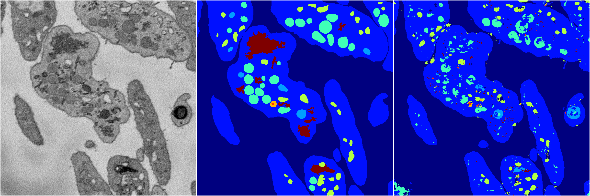
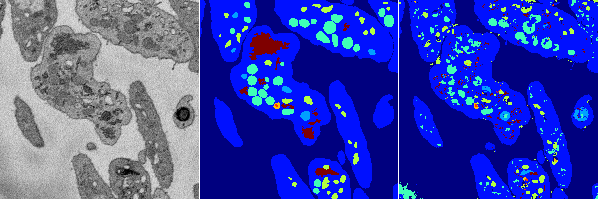
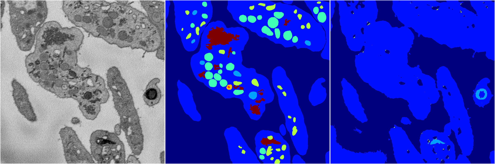
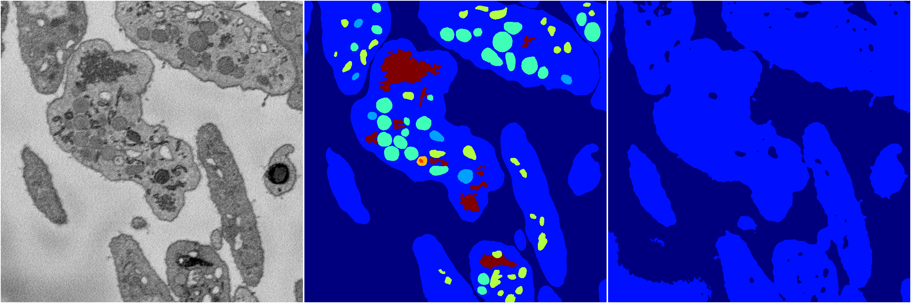
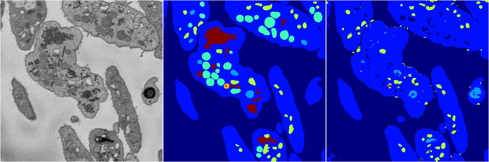

[Back](..)&nbsp;&nbsp;&nbsp;&nbsp;&nbsp;[Home](https://leapmanlab.github.io/snapshots)

---

<a href="0"><h2>random_2d_ed / 1216 / 93 / 0</h2></a>
Created 21 Dec 2018, 01:15:55

<i>Click for more details</i>

**ari**: 0.7392. **miou**: 0.4082. **accuracy**: 0.8799. **n_params**: 697429.0000. 

---

<a href="3"><h2>random_2d_ed / 1216 / 93 / 3</h2></a>
Created 21 Dec 2018, 01:15:55

<i>Click for more details</i>

**ari**: 0.7365. **miou**: 0.4220. **accuracy**: 0.8755. **n_params**: 697429.0000. 

---

<a href="1"><h2>random_2d_ed / 1216 / 93 / 1</h2></a>
Created 21 Dec 2018, 01:15:55

<i>Click for more details</i>

**ari**: 0.6021. **miou**: 0.2067. **accuracy**: 0.8360. **n_params**: 697429.0000. 

---

<a href="4"><h2>random_2d_ed / 1216 / 93 / 4</h2></a>
Created 21 Dec 2018, 01:15:55

<i>Click for more details</i>

**ari**: 0.5877. **miou**: 0.2009. **accuracy**: 0.8336. **n_params**: 697429.0000. 

---

<a href="2"><h2>random_2d_ed / 1216 / 93 / 2</h2></a>
Created 21 Dec 2018, 01:15:55

<i>Click for more details</i>

**ari**: 0.7088. **miou**: 0.3817. **accuracy**: 0.8719. **n_params**: 697429.0000. 

---

[Back](..)&nbsp;&nbsp;&nbsp;&nbsp;&nbsp;[Home](https://leapmanlab.github.io/snapshots)

---