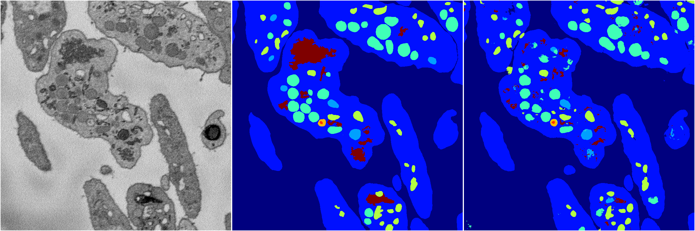
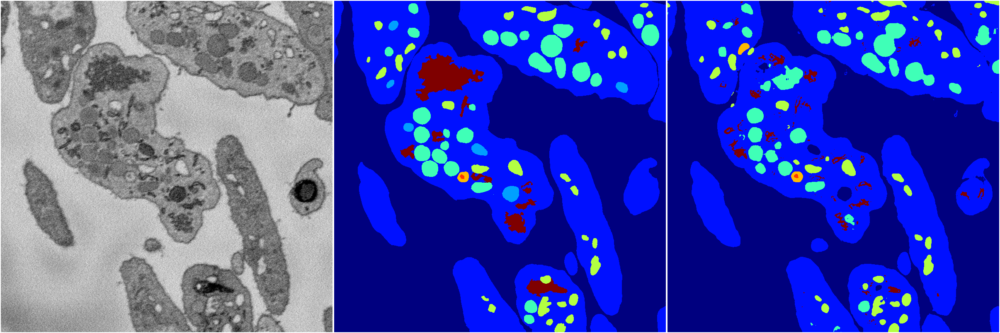
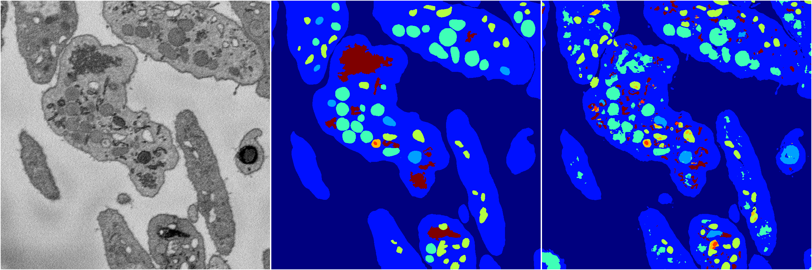
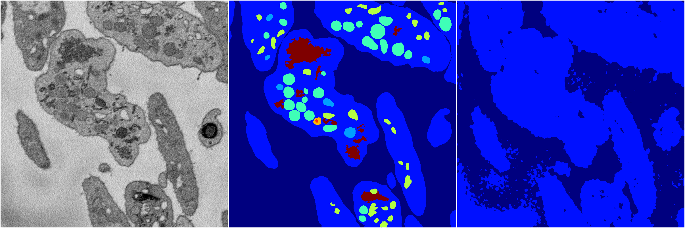

[Back](..)&nbsp;&nbsp;&nbsp;&nbsp;&nbsp;[Home](https://leapmanlab.github.io/snapshots)

---

<a href="2"><h2>random_2d_ed / 1216 / 95 / 2</h2></a>
Created 21 Dec 2018, 14:17:46

<i>Click for more details</i>

**ari**: 0.8105. **miou**: 0.5442. **accuracy**: 0.9217. **n_params**: 2292994.0000. 

---

<a href="3"><h2>random_2d_ed / 1216 / 95 / 3</h2></a>
Created 21 Dec 2018, 14:17:46

<i>Click for more details</i>

**ari**: 0.8011. **miou**: 0.4793. **accuracy**: 0.9164. **n_params**: 2292994.0000. 

---

<a href="4"><h2>random_2d_ed / 1216 / 95 / 4</h2></a>
Created 21 Dec 2018, 14:17:46

<i>Click for more details</i>

**ari**: 0.8111. **miou**: 0.4989. **accuracy**: 0.9179. **n_params**: 2292994.0000. 

---

<a href="1"><h2>random_2d_ed / 1216 / 95 / 1</h2></a>
Created 21 Dec 2018, 14:17:46

<i>Click for more details</i>

**ari**: 0.7749. **miou**: 0.4537. **accuracy**: 0.8979. **n_params**: 2292994.0000. 

---

<a href="0"><h2>random_2d_ed / 1216 / 95 / 0</h2></a>
Created 21 Dec 2018, 14:17:46

<i>Click for more details</i>

**ari**: 0.4684. **miou**: 0.1835. **accuracy**: 0.8087. **n_params**: 2292994.0000. 

---

[Back](..)&nbsp;&nbsp;&nbsp;&nbsp;&nbsp;[Home](https://leapmanlab.github.io/snapshots)

---