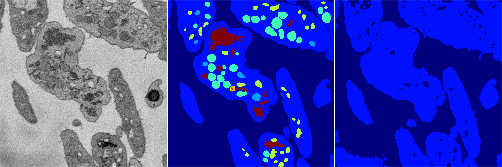
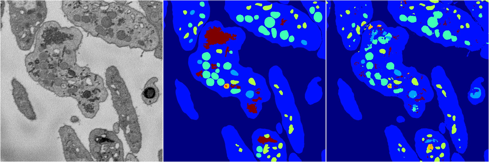

[Back](..)&nbsp;&nbsp;&nbsp;&nbsp;&nbsp;[Home](https://leapmanlab.github.io/snapshots)

---

<a href="0"><h2>random_2d_ed / 1216 / 96 / 0</h2></a>
Created 21 Dec 2018, 14:17:46

<i>Click for more details</i>

**ari**: 0.8116. **miou**: 0.5446. **accuracy**: 0.9164. **n_params**: 2674582.0000. 

---

<a href="3"><h2>random_2d_ed / 1216 / 96 / 3</h2></a>
Created 21 Dec 2018, 14:17:46

<i>Click for more details</i>

**ari**: 0.6105. **miou**: 0.2017. **accuracy**: 0.8456. **n_params**: 2674582.0000. 

---

<a href="1"><h2>random_2d_ed / 1216 / 96 / 1</h2></a>
Created 21 Dec 2018, 14:17:46

<i>Click for more details</i>

**ari**: 0.8047. **miou**: 0.5080. **accuracy**: 0.9100. **n_params**: 2674582.0000. 

---

<a href="2"><h2>random_2d_ed / 1216 / 96 / 2</h2></a>
Created 21 Dec 2018, 14:17:46

<i>Click for more details</i>

**ari**: 0.6071. **miou**: 0.2002. **accuracy**: 0.8428. **n_params**: 2674582.0000. 

---

[Back](..)&nbsp;&nbsp;&nbsp;&nbsp;&nbsp;[Home](https://leapmanlab.github.io/snapshots)

---