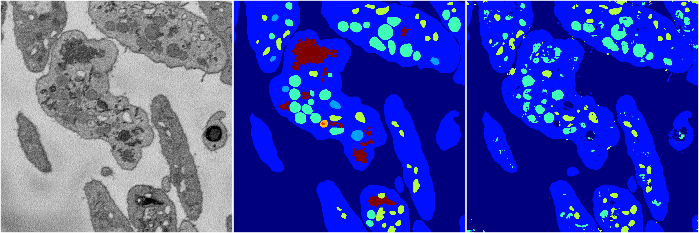
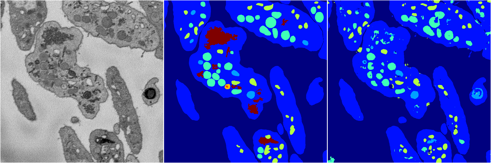
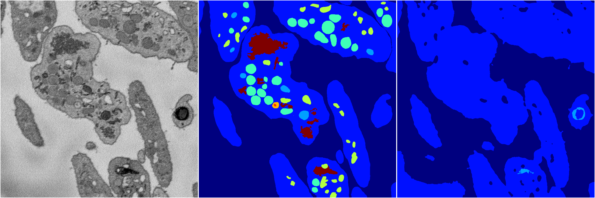
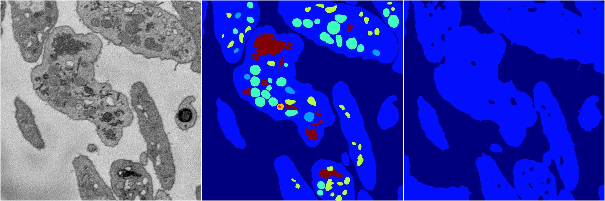

[Back](..)&nbsp;&nbsp;&nbsp;&nbsp;&nbsp;[Home](https://leapmanlab.github.io/snapshots)

---

<a href="0"><h2>random_2d_ed / 1216 / 97 / 0</h2></a>
Created 21 Dec 2018, 01:15:55

<i>Click for more details</i>

**ari**: 0.7411. **miou**: 0.3402. **accuracy**: 0.8816. **n_params**: 2456801.0000. 

---

<a href="3"><h2>random_2d_ed / 1216 / 97 / 3</h2></a>
Created 21 Dec 2018, 01:15:55

<i>Click for more details</i>

**ari**: 0.7774. **miou**: 0.4186. **accuracy**: 0.8994. **n_params**: 2456801.0000. 

---

<a href="1"><h2>random_2d_ed / 1216 / 97 / 1</h2></a>
Created 21 Dec 2018, 01:15:55

<i>Click for more details</i>

**ari**: 0.7767. **miou**: 0.5137. **accuracy**: 0.8983. **n_params**: 2456801.0000. 

---

<a href="4"><h2>random_2d_ed / 1216 / 97 / 4</h2></a>
Created 21 Dec 2018, 01:15:55

<i>Click for more details</i>

**ari**: 0.6074. **miou**: 0.2034. **accuracy**: 0.8402. **n_params**: 2456801.0000. 

---

<a href="2"><h2>random_2d_ed / 1216 / 97 / 2</h2></a>
Created 21 Dec 2018, 01:15:55

<i>Click for more details</i>

**ari**: 0.6179. **miou**: 0.2040. **accuracy**: 0.8435. **n_params**: 2456801.0000. 

---

[Back](..)&nbsp;&nbsp;&nbsp;&nbsp;&nbsp;[Home](https://leapmanlab.github.io/snapshots)

---