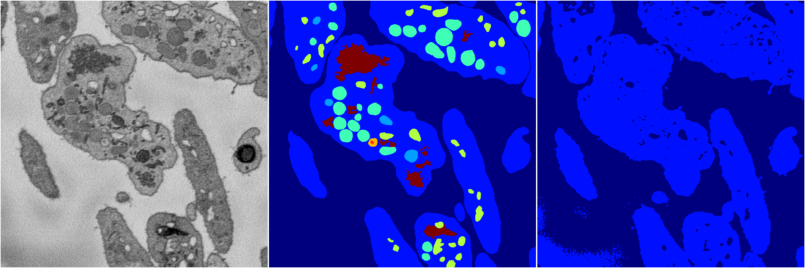
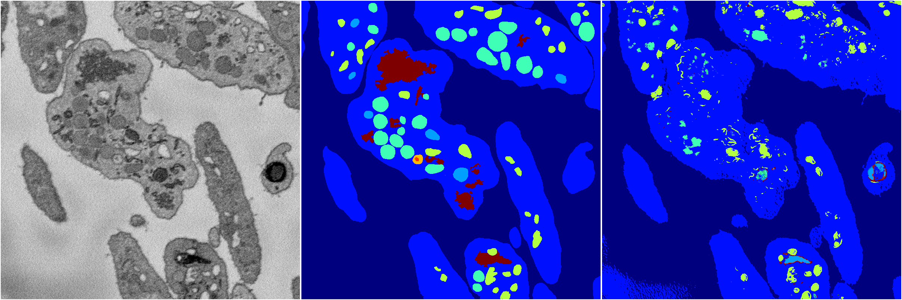

[Back](..)&nbsp;&nbsp;&nbsp;&nbsp;&nbsp;[Home](https://leapmanlab.github.io/snapshots)

---

<a href="4"><h2>random_2d_ed / 1216 / 98 / 4</h2></a>
Created 17 Dec 2018, 23:35:16

<i>Click for more details</i>

**ari**: 0.5204. **miou**: 0.2041. **accuracy**: 0.8519. **n_params**: 26736133.0000. 

---

<a href="2"><h2>random_2d_ed / 1216 / 98 / 2</h2></a>
Created 17 Dec 2018, 23:35:16

<i>Click for more details</i>

**ari**: 0.6610. **miou**: 0.3958. **accuracy**: 0.9051. **n_params**: 26736133.0000. 

---

<a href="3"><h2>random_2d_ed / 1216 / 98 / 3</h2></a>
Created 17 Dec 2018, 23:35:16

<i>Click for more details</i>

**ari**: 0.6100. **miou**: 0.3163. **accuracy**: 0.8882. **n_params**: 26736133.0000. 

---

<a href="1"><h2>random_2d_ed / 1216 / 98 / 1</h2></a>
Created 17 Dec 2018, 23:35:16

<i>Click for more details</i>

**ari**: 0.4603. **miou**: 0.1999. **accuracy**: 0.8427. **n_params**: 26736133.0000. 

---

<a href="0"><h2>random_2d_ed / 1216 / 98 / 0</h2></a>
Created 17 Dec 2018, 23:35:16

<i>Click for more details</i>

**ari**: 0.5268. **miou**: 0.2809. **accuracy**: 0.8624. **n_params**: 26736133.0000. 

---

[Back](..)&nbsp;&nbsp;&nbsp;&nbsp;&nbsp;[Home](https://leapmanlab.github.io/snapshots)

---