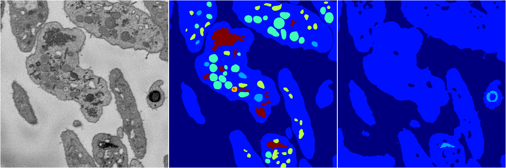
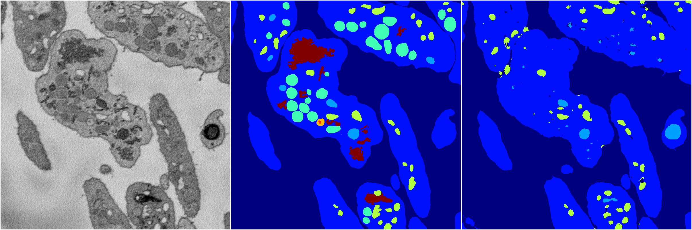
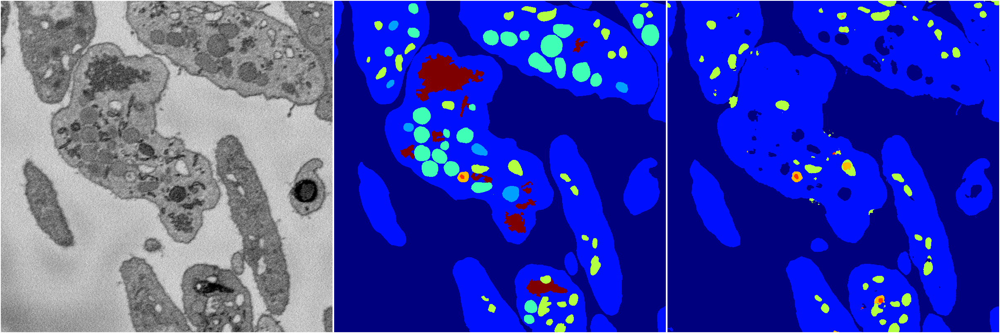

[Back](..)&nbsp;&nbsp;&nbsp;&nbsp;&nbsp;[Home](https://leapmanlab.github.io/snapshots)

---

<a href="0"><h2>random_2d_ed / 1216 / 99 / 0</h2></a>
Created 21 Dec 2018, 01:15:55

<i>Click for more details</i>

**ari**: 0.7146. **miou**: 0.3534. **accuracy**: 0.8740. **n_params**: 928663.0000. 

---

<a href="3"><h2>random_2d_ed / 1216 / 99 / 3</h2></a>
Created 21 Dec 2018, 01:15:55

<i>Click for more details</i>

**ari**: 0.6118. **miou**: 0.2045. **accuracy**: 0.8416. **n_params**: 928663.0000. 

---

<a href="1"><h2>random_2d_ed / 1216 / 99 / 1</h2></a>
Created 21 Dec 2018, 01:15:55

<i>Click for more details</i>

**ari**: 0.7296. **miou**: 0.3400. **accuracy**: 0.8823. **n_params**: 928663.0000. 

---

<a href="4"><h2>random_2d_ed / 1216 / 99 / 4</h2></a>
Created 21 Dec 2018, 01:15:55

<i>Click for more details</i>

**ari**: 0.7166. **miou**: 0.3670. **accuracy**: 0.8760. **n_params**: 928663.0000. 

---

<a href="2"><h2>random_2d_ed / 1216 / 99 / 2</h2></a>
Created 21 Dec 2018, 01:15:55

<i>Click for more details</i>

**ari**: 0.7759. **miou**: 0.4731. **accuracy**: 0.8974. **n_params**: 928663.0000. 

---

[Back](..)&nbsp;&nbsp;&nbsp;&nbsp;&nbsp;[Home](https://leapmanlab.github.io/snapshots)

---