[Back](..)&nbsp;&nbsp;&nbsp;&nbsp;&nbsp;[Home](https://leapmanlab.github.io/snapshots)

---

<a href="6"><h2>random_2d_ed / 1216 / 6</h2></a>
Created 21 Dec 2018, 01:15:55

<i>Click image for more details</i>

5 nets

**ari**: min 0.5762. max 0.6301. mean 0.5990.  ([best net](6/3))

**miou**: min 0.1997. max 0.2358. mean 0.2112.  ([best net](6/3))

**accuracy**: min 0.8295. max 0.8420. mean 0.8336.  ([best net](6/3))

**n_params**: min 197039.0000. max 197039.0000. mean 197039.0000.  ([best net](6/0))

---

<a href="87"><h2>random_2d_ed / 1216 / 87</h2></a>
Created 21 Dec 2018, 01:15:55

<a href="87">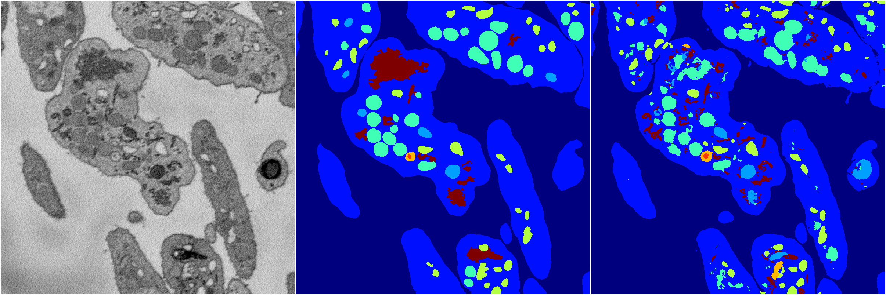</a>
<i>Click image for more details</i>

5 nets

**ari**: min 0.7626. max 0.8199. mean 0.7889.  ([best net](87/4))

**miou**: min 0.3681. max 0.5089. mean 0.4286.  ([best net](87/0))

**accuracy**: min 0.8984. max 0.9220. mean 0.9064.  ([best net](87/4))

**n_params**: min 3586068.0000. max 3586068.0000. mean 3586068.0000.  ([best net](87/0))

---

<a href="94"><h2>random_2d_ed / 1216 / 94</h2></a>
Created 21 Dec 2018, 01:15:55

<i>Click image for more details</i>

5 nets

**ari**: min 0.6155. max 0.7889. mean 0.7048.  ([best net](94/0))

**miou**: min 0.2100. max 0.4727. mean 0.3315.  ([best net](94/3))

**accuracy**: min 0.8444. max 0.9049. mean 0.8747.  ([best net](94/0))

**n_params**: min 1601385.0000. max 1601385.0000. mean 1601385.0000.  ([best net](94/0))

---

<a href="29"><h2>random_2d_ed / 1216 / 29</h2></a>
Created 21 Dec 2018, 01:15:55

<a href="29">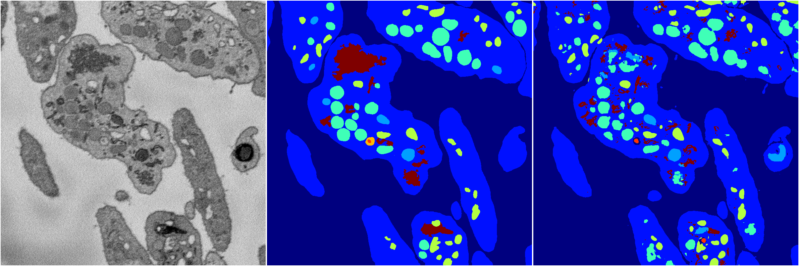</a>
<i>Click image for more details</i>

5 nets

**ari**: min 0.7344. max 0.8131. mean 0.7867.  ([best net](29/0))

**miou**: min 0.2897. max 0.4987. mean 0.3909.  ([best net](29/4))

**accuracy**: min 0.8879. max 0.9139. mean 0.9041.  ([best net](29/0))

**n_params**: min 6396968.0000. max 6396968.0000. mean 6396968.0000.  ([best net](29/0))

---

<a href="46"><h2>random_2d_ed / 1216 / 46</h2></a>
Created 21 Dec 2018, 01:15:55

<a href="46">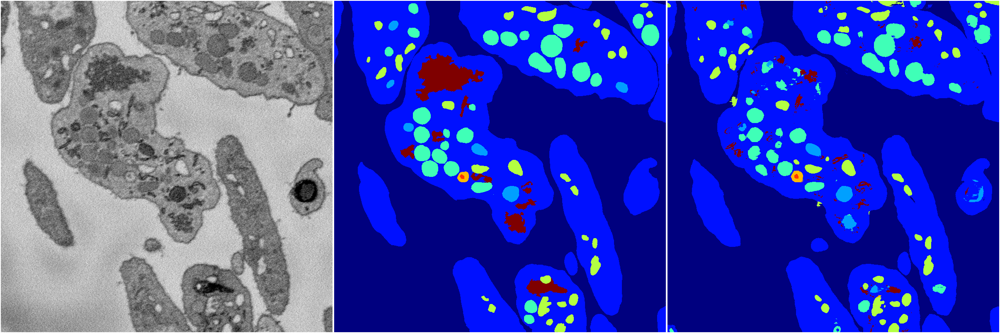</a>
<i>Click image for more details</i>

5 nets

**ari**: min 0.0692. max 0.7995. mean 0.6408.  ([best net](46/2))

**miou**: min 0.0973. max 0.5629. mean 0.3686.  ([best net](46/2))

**accuracy**: min 0.4945. max 0.9186. mean 0.8257.  ([best net](46/2))

**n_params**: min 4884620.0000. max 4884620.0000. mean 4884620.0000.  ([best net](46/0))

---

<a href="77"><h2>random_2d_ed / 1216 / 77</h2></a>
Created 21 Dec 2018, 01:15:55

<a href="77">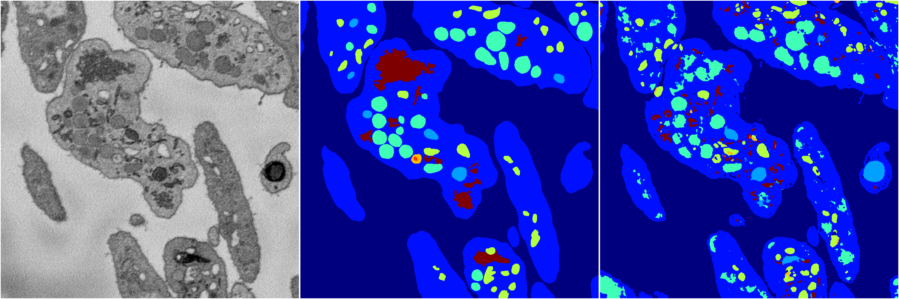</a>
<i>Click image for more details</i>

5 nets

**ari**: min 0.6903. max 0.7828. mean 0.7405.  ([best net](77/0))

**miou**: min 0.2097. max 0.4204. mean 0.3455.  ([best net](77/4))

**accuracy**: min 0.8665. max 0.9030. mean 0.8836.  ([best net](77/2))

**n_params**: min 2911571.0000. max 2911571.0000. mean 2911571.0000.  ([best net](77/0))

---

<a href="47"><h2>random_2d_ed / 1216 / 47</h2></a>
Created 21 Dec 2018, 01:15:55

<a href="47">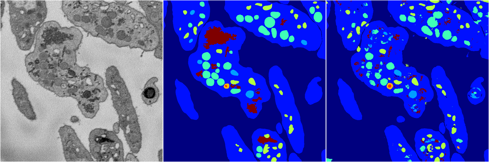</a>
<i>Click image for more details</i>

5 nets

**ari**: min 0.6083. max 0.7917. mean 0.7446.  ([best net](47/4))

**miou**: min 0.2391. max 0.5389. mean 0.4021.  ([best net](47/4))

**accuracy**: min 0.8190. max 0.9087. mean 0.8852.  ([best net](47/1))

**n_params**: min 3719100.0000. max 3719100.0000. mean 3719100.0000.  ([best net](47/0))

---

<a href="13"><h2>random_2d_ed / 1216 / 13</h2></a>
Created 21 Dec 2018, 01:15:55

<i>Click image for more details</i>

3 nets

**ari**: min 0.6189. max 0.7594. mean 0.6954.  ([best net](13/2))

**miou**: min 0.2157. max 0.3486. mean 0.2875.  ([best net](13/2))

**accuracy**: min 0.8553. max 0.8978. mean 0.8798.  ([best net](13/2))

**n_params**: min 39472433.0000. max 39472433.0000. mean 39472433.0000.  ([best net](13/1))

---

<a href="17"><h2>random_2d_ed / 1216 / 17</h2></a>
Created 21 Dec 2018, 01:15:55

<a href="17">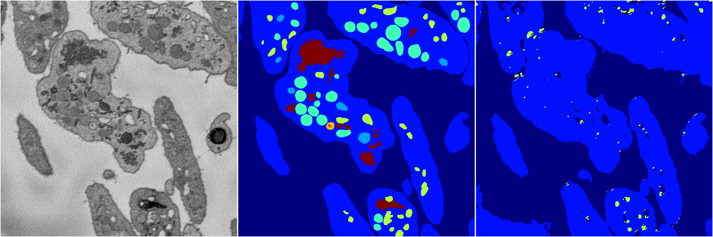</a>
<i>Click image for more details</i>

5 nets

**ari**: min 0.5118. max 0.5330. mean 0.5196.  ([best net](17/4))

**miou**: min 0.2040. max 0.2385. mean 0.2171.  ([best net](17/4))

**accuracy**: min 0.8520. max 0.8634. mean 0.8584.  ([best net](17/3))

**n_params**: min 4738752.0000. max 4738752.0000. mean 4738752.0000.  ([best net](17/0))

---

<a href="41"><h2>random_2d_ed / 1216 / 41</h2></a>
Created 21 Dec 2018, 01:15:55

<a href="41">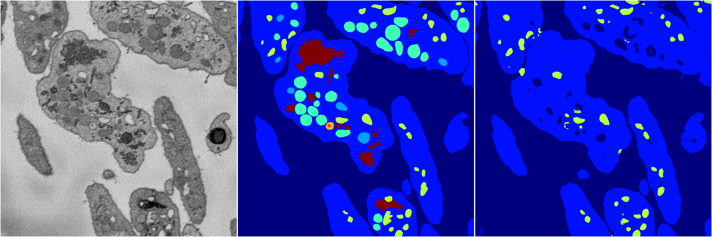</a>
<i>Click image for more details</i>

5 nets

**ari**: min 0.1796. max 0.7166. mean 0.5246.  ([best net](41/3))

**miou**: min 0.1274. max 0.2862. mean 0.2129.  ([best net](41/3))

**accuracy**: min 0.4732. max 0.8763. mean 0.7694.  ([best net](41/3))

**n_params**: min 79030.0000. max 79030.0000. mean 79030.0000.  ([best net](41/0))

---

<a href="10"><h2>random_2d_ed / 1216 / 10</h2></a>
Created 21 Dec 2018, 01:15:55

<i>Click image for more details</i>

5 nets

**ari**: min 0.6166. max 0.8142. mean 0.7192.  ([best net](10/1))

**miou**: min 0.2020. max 0.5346. mean 0.3443.  ([best net](10/1))

**accuracy**: min 0.8525. max 0.9186. mean 0.8853.  ([best net](10/1))

**n_params**: min 3350997.0000. max 3350997.0000. mean 3350997.0000.  ([best net](10/0))

---

<a href="21"><h2>random_2d_ed / 1216 / 21</h2></a>
Created 21 Dec 2018, 01:15:55

<a href="21">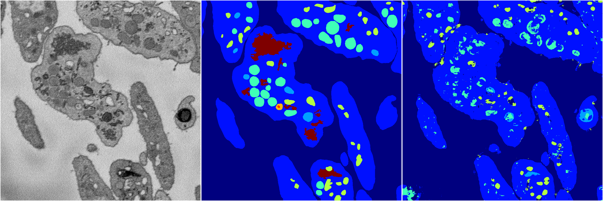</a>
<i>Click image for more details</i>

5 nets

**ari**: min 0.6942. max 0.7559. mean 0.7297.  ([best net](21/0))

**miou**: min 0.2471. max 0.3620. mean 0.2902.  ([best net](21/0))

**accuracy**: min 0.8751. max 0.8896. mean 0.8832.  ([best net](21/0))

**n_params**: min 2459732.0000. max 2459732.0000. mean 2459732.0000.  ([best net](21/0))

---

<a href="67"><h2>random_2d_ed / 1216 / 67</h2></a>
Created 21 Dec 2018, 01:15:55

<i>Click image for more details</i>

5 nets

**ari**: min 0.6178. max 0.7519. mean 0.6995.  ([best net](67/0))

**miou**: min 0.2164. max 0.4196. mean 0.3131.  ([best net](67/0))

**accuracy**: min 0.8425. max 0.8879. mean 0.8670.  ([best net](67/0))

**n_params**: min 1880229.0000. max 1880229.0000. mean 1880229.0000.  ([best net](67/0))

---

<a href="71"><h2>random_2d_ed / 1216 / 71</h2></a>
Created 21 Dec 2018, 01:15:55

<i>Click image for more details</i>

5 nets

**ari**: min 0.6511. max 0.8048. mean 0.7603.  ([best net](71/1))

**miou**: min 0.2056. max 0.4495. mean 0.3592.  ([best net](71/1))

**accuracy**: min 0.8617. max 0.9151. mean 0.8975.  ([best net](71/3))

**n_params**: min 1227436.0000. max 1227436.0000. mean 1227436.0000.  ([best net](71/0))

---

<a href="40"><h2>random_2d_ed / 1216 / 40</h2></a>
Created 21 Dec 2018, 01:15:55

<a href="40">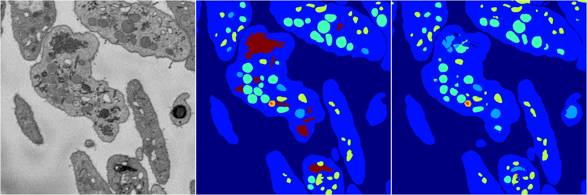</a>
<i>Click image for more details</i>

5 nets

**ari**: min 0.6103. max 0.8198. mean 0.7666.  ([best net](40/3))

**miou**: min 0.2065. max 0.5400. mean 0.4466.  ([best net](40/1))

**accuracy**: min 0.8480. max 0.9191. mean 0.9007.  ([best net](40/3))

**n_params**: min 1822954.0000. max 1822954.0000. mean 1822954.0000.  ([best net](40/0))

---

<a href="64"><h2>random_2d_ed / 1216 / 64</h2></a>
Created 21 Dec 2018, 01:15:55

<i>Click image for more details</i>

5 nets

**ari**: min 0.6764. max 0.7731. mean 0.7445.  ([best net](64/1))

**miou**: min 0.2545. max 0.3700. mean 0.3187.  ([best net](64/1))

**accuracy**: min 0.8774. max 0.9056. mean 0.8964.  ([best net](64/1))

**n_params**: min 2988905.0000. max 2988905.0000. mean 2988905.0000.  ([best net](64/0))

---

<a href="2"><h2>random_2d_ed / 1216 / 2</h2></a>
Created 21 Dec 2018, 01:15:55

<i>Click image for more details</i>

5 nets

**ari**: min 0.6081. max 0.8087. mean 0.7093.  ([best net](2/3))

**miou**: min 0.2018. max 0.4978. mean 0.3290.  ([best net](2/3))

**accuracy**: min 0.8473. max 0.9174. mean 0.8796.  ([best net](2/3))

**n_params**: min 10570496.0000. max 10570496.0000. mean 10570496.0000.  ([best net](2/0))

---

<a href="49"><h2>random_2d_ed / 1216 / 49</h2></a>
Created 21 Dec 2018, 01:15:55

<i>Click image for more details</i>

5 nets

**ari**: min 0.5961. max 0.7275. mean 0.6586.  ([best net](49/1))

**miou**: min 0.2036. max 0.3392. mean 0.2692.  ([best net](49/1))

**accuracy**: min 0.8342. max 0.8727. mean 0.8539.  ([best net](49/1))

**n_params**: min 383782.0000. max 383782.0000. mean 383782.0000.  ([best net](49/0))

---

<a href="7"><h2>random_2d_ed / 1216 / 7</h2></a>
Created 21 Dec 2018, 01:15:55

<a href="7">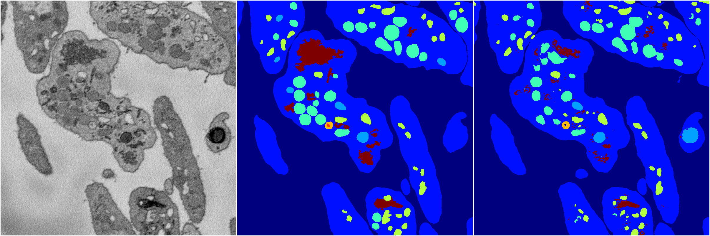</a>
<i>Click image for more details</i>

4 nets

**ari**: min 0.6315. max 0.7890. mean 0.7153.  ([best net](7/3))

**miou**: min 0.2321. max 0.4385. mean 0.3349.  ([best net](7/3))

**accuracy**: min 0.8567. max 0.9144. mean 0.8898.  ([best net](7/3))

**n_params**: min 79725172.0000. max 79725172.0000. mean 79725172.0000.  ([best net](7/0))

---

<a href="14"><h2>random_2d_ed / 1216 / 14</h2></a>
Created 21 Dec 2018, 01:15:55

<a href="14">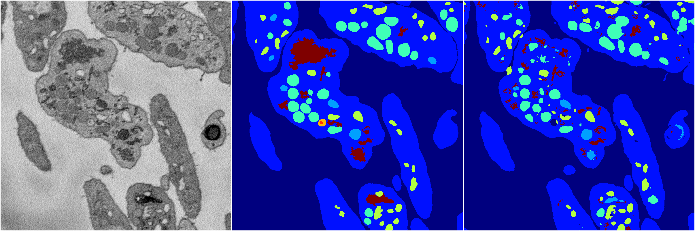</a>
<i>Click image for more details</i>

3 nets

**ari**: min 0.6331. max 0.8023. mean 0.7245.  ([best net](14/1))

**miou**: min 0.2424. max 0.4566. mean 0.3321.  ([best net](14/1))

**accuracy**: min 0.8532. max 0.9126. mean 0.8842.  ([best net](14/1))

**n_params**: min 7185509.0000. max 7185509.0000. mean 7185509.0000.  ([best net](14/1))

---

<a href="42"><h2>random_2d_ed / 1216 / 42</h2></a>
Created 21 Dec 2018, 01:15:55

<i>Click image for more details</i>

5 nets

**ari**: min 0.6520. max 0.7454. mean 0.6980.  ([best net](42/3))

**miou**: min 0.2591. max 0.3805. mean 0.3077.  ([best net](42/3))

**accuracy**: min 0.8618. max 0.8975. mean 0.8794.  ([best net](42/3))

**n_params**: min 4018424.0000. max 4018424.0000. mean 4018424.0000.  ([best net](42/0))

---

<a href="24"><h2>random_2d_ed / 1216 / 24</h2></a>
Created 21 Dec 2018, 01:15:55

<a href="24">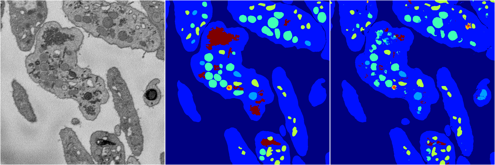</a>
<i>Click image for more details</i>

5 nets

**ari**: min 0.6630. max 0.8096. mean 0.7337.  ([best net](24/1))

**miou**: min 0.2074. max 0.4809. mean 0.3316.  ([best net](24/1))

**accuracy**: min 0.8642. max 0.9174. mean 0.8843.  ([best net](24/1))

**n_params**: min 2595144.0000. max 2595144.0000. mean 2595144.0000.  ([best net](24/0))

---

<a href="91"><h2>random_2d_ed / 1216 / 91</h2></a>
Created 21 Dec 2018, 01:15:55

<i>Click image for more details</i>

5 nets

**ari**: min 0.5867. max 0.6473. mean 0.6300.  ([best net](91/1))

**miou**: min 0.2015. max 0.2587. mean 0.2356.  ([best net](91/1))

**accuracy**: min 0.8322. max 0.8420. mean 0.8390.  ([best net](91/4))

**n_params**: min 230746.0000. max 230746.0000. mean 230746.0000.  ([best net](91/0))

---

<a href="88"><h2>random_2d_ed / 1216 / 88</h2></a>
Created 21 Dec 2018, 01:15:55

<a href="88">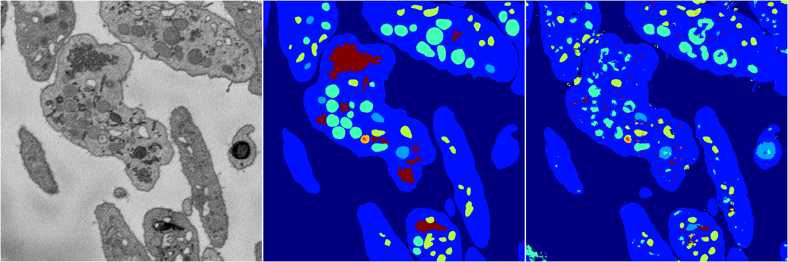</a>
<i>Click image for more details</i>

5 nets

**ari**: min 0.5794. max 0.7543. mean 0.6757.  ([best net](88/2))

**miou**: min 0.1997. max 0.4263. mean 0.2870.  ([best net](88/2))

**accuracy**: min 0.8323. max 0.8866. mean 0.8609.  ([best net](88/2))

**n_params**: min 88439.0000. max 88439.0000. mean 88439.0000.  ([best net](88/0))

---

<a href="35"><h2>random_2d_ed / 1216 / 35</h2></a>
Created 21 Dec 2018, 01:15:55

<i>Click image for more details</i>

5 nets

**ari**: min 0.7365. max 0.7786. mean 0.7640.  ([best net](35/3))

**miou**: min 0.3515. max 0.4806. mean 0.4288.  ([best net](35/3))

**accuracy**: min 0.8769. max 0.9008. mean 0.8926.  ([best net](35/3))

**n_params**: min 373862.0000. max 373862.0000. mean 373862.0000.  ([best net](35/0))

---

<a href="48"><h2>random_2d_ed / 1216 / 48</h2></a>
Created 21 Dec 2018, 01:15:55

<i>Click image for more details</i>

5 nets

**ari**: min 0.1907. max 0.7411. mean 0.6079.  ([best net](48/3))

**miou**: min 0.1176. max 0.3549. mean 0.2827.  ([best net](48/3))

**accuracy**: min 0.4627. max 0.8847. mean 0.7886.  ([best net](48/3))

**n_params**: min 801037.0000. max 801037.0000. mean 801037.0000.  ([best net](48/0))

---

<a href="16"><h2>random_2d_ed / 1216 / 16</h2></a>
Created 21 Dec 2018, 01:15:55

<i>Click image for more details</i>

5 nets

**ari**: min 0.5881. max 0.7981. mean 0.6823.  ([best net](16/3))

**miou**: min 0.2029. max 0.5632. mean 0.3208.  ([best net](16/3))

**accuracy**: min 0.8329. max 0.9133. mean 0.8688.  ([best net](16/3))

**n_params**: min 2729279.0000. max 2729279.0000. mean 2729279.0000.  ([best net](16/0))

---

<a href="25"><h2>random_2d_ed / 1216 / 25</h2></a>
Created 21 Dec 2018, 01:15:55

<i>Click image for more details</i>

5 nets

**ari**: min 0.6897. max 0.7873. mean 0.7487.  ([best net](25/3))

**miou**: min 0.2845. max 0.4412. mean 0.3746.  ([best net](25/4))

**accuracy**: min 0.8753. max 0.9119. mean 0.8958.  ([best net](25/3))

**n_params**: min 10166160.0000. max 10166160.0000. mean 10166160.0000.  ([best net](25/0))

---

<a href="43"><h2>random_2d_ed / 1216 / 43</h2></a>
Created 21 Dec 2018, 01:15:55

<i>Click image for more details</i>

5 nets

**ari**: min 0.5802. max 0.7101. mean 0.6291.  ([best net](43/4))

**miou**: min 0.2001. max 0.3651. mean 0.2481.  ([best net](43/4))

**accuracy**: min 0.8311. max 0.8582. mean 0.8431.  ([best net](43/4))

**n_params**: min 783040.0000. max 783040.0000. mean 783040.0000.  ([best net](43/0))

---

<a href="37"><h2>random_2d_ed / 1216 / 37</h2></a>
Created 21 Dec 2018, 01:15:55

<a href="37">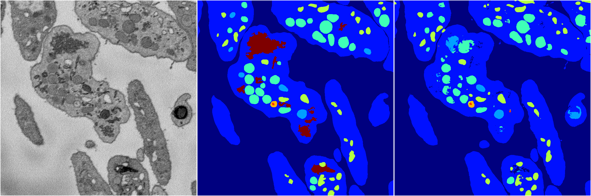</a>
<i>Click image for more details</i>

5 nets

**ari**: min 0.6646. max 0.8090. mean 0.7728.  ([best net](37/4))

**miou**: min 0.2976. max 0.5425. mean 0.4299.  ([best net](37/4))

**accuracy**: min 0.8446. max 0.9164. mean 0.8971.  ([best net](37/4))

**n_params**: min 1598914.0000. max 1598914.0000. mean 1598914.0000.  ([best net](37/0))

---

<a href="70"><h2>random_2d_ed / 1216 / 70</h2></a>
Created 21 Dec 2018, 01:15:55

<a href="70">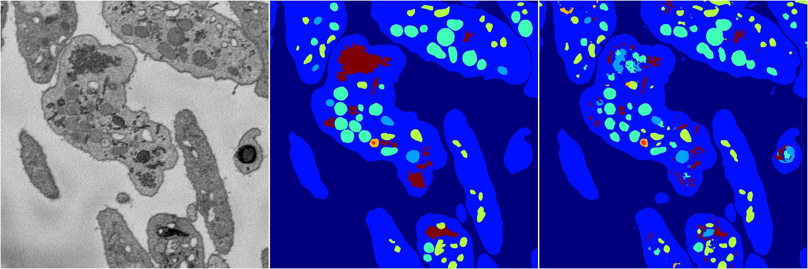</a>
<i>Click image for more details</i>

5 nets

**ari**: min 0.6859. max 0.7940. mean 0.7508.  ([best net](70/2))

**miou**: min 0.2764. max 0.5326. mean 0.3718.  ([best net](70/2))

**accuracy**: min 0.8729. max 0.9122. mean 0.8936.  ([best net](70/2))

**n_params**: min 2344844.0000. max 2344844.0000. mean 2344844.0000.  ([best net](70/0))

---

<a href="86"><h2>random_2d_ed / 1216 / 86</h2></a>
Created 21 Dec 2018, 01:15:55

<a href="86">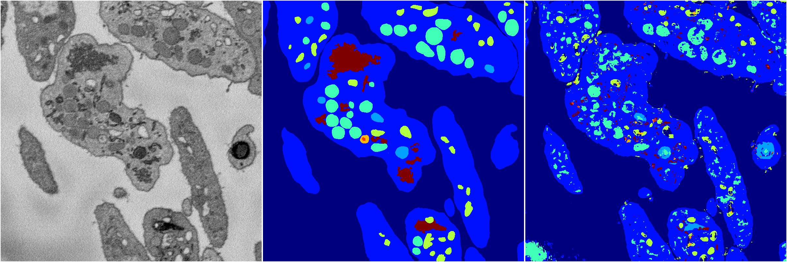</a>
<i>Click image for more details</i>

5 nets

**ari**: min 0.4830. max 0.7215. mean 0.6532.  ([best net](86/4))

**miou**: min 0.2242. max 0.3783. mean 0.3263.  ([best net](86/0))

**accuracy**: min 0.7920. max 0.8692. mean 0.8414.  ([best net](86/4))

**n_params**: min 752535.0000. max 752535.0000. mean 752535.0000.  ([best net](86/0))

---

<a href="99"><h2>random_2d_ed / 1216 / 99</h2></a>
Created 21 Dec 2018, 01:15:55

<a href="99">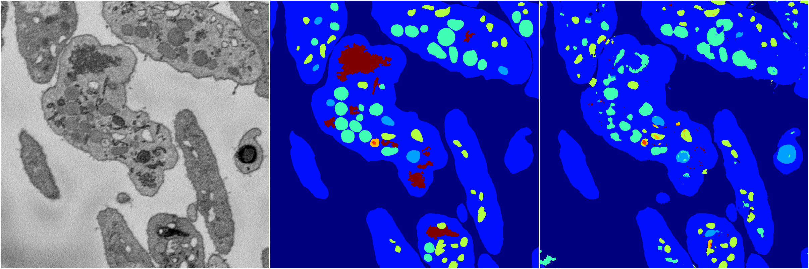</a>
<i>Click image for more details</i>

5 nets

**ari**: min 0.6118. max 0.7759. mean 0.7097.  ([best net](99/2))

**miou**: min 0.2045. max 0.4731. mean 0.3476.  ([best net](99/2))

**accuracy**: min 0.8416. max 0.8974. mean 0.8743.  ([best net](99/2))

**n_params**: min 928663.0000. max 928663.0000. mean 928663.0000.  ([best net](99/0))

---

<a href="84"><h2>random_2d_ed / 1216 / 84</h2></a>
Created 21 Dec 2018, 01:15:55

<a href="84">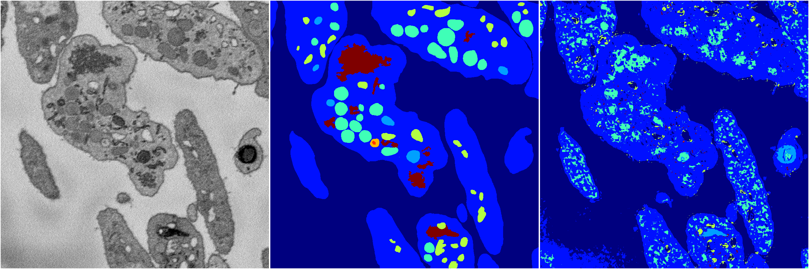</a>
<i>Click image for more details</i>

5 nets

**ari**: min 0.5780. max 0.6212. mean 0.6004.  ([best net](84/4))

**miou**: min 0.2007. max 0.2564. mean 0.2221.  ([best net](84/0))

**accuracy**: min 0.8132. max 0.8405. mean 0.8298.  ([best net](84/4))

**n_params**: min 207581.0000. max 207581.0000. mean 207581.0000.  ([best net](84/0))

---

<a href="78"><h2>random_2d_ed / 1216 / 78</h2></a>
Created 21 Dec 2018, 01:15:55

<a href="78">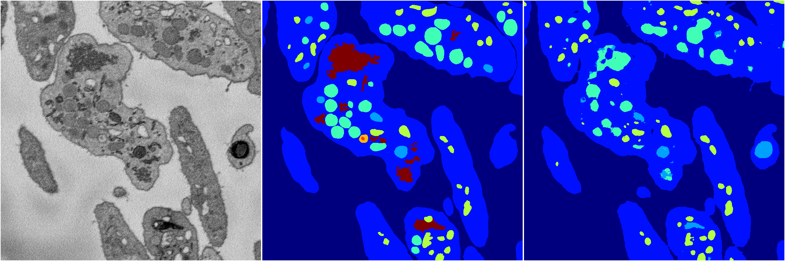</a>
<i>Click image for more details</i>

5 nets

**ari**: min 0.5128. max 0.7111. mean 0.5949.  ([best net](78/4))

**miou**: min 0.1995. max 0.3772. mean 0.2638.  ([best net](78/4))

**accuracy**: min 0.8406. max 0.8971. mean 0.8630.  ([best net](78/4))

**n_params**: min 9815751.0000. max 9815751.0000. mean 9815751.0000.  ([best net](78/0))

---

<a href="58"><h2>random_2d_ed / 1216 / 58</h2></a>
Created 21 Dec 2018, 01:15:55

<a href="58">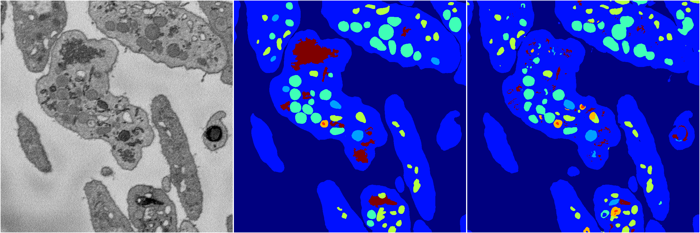</a>
<i>Click image for more details</i>

5 nets

**ari**: min 0.7619. max 0.8218. mean 0.7905.  ([best net](58/0))

**miou**: min 0.3825. max 0.5645. mean 0.4250.  ([best net](58/0))

**accuracy**: min 0.8979. max 0.9240. mean 0.9069.  ([best net](58/0))

**n_params**: min 4069783.0000. max 4069783.0000. mean 4069783.0000.  ([best net](58/0))

---

<a href="90"><h2>random_2d_ed / 1216 / 90</h2></a>
Created 21 Dec 2018, 01:15:55

<a href="90">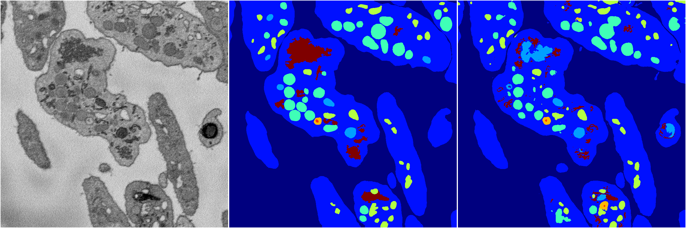</a>
<i>Click image for more details</i>

5 nets

**ari**: min 0.6362. max 0.8177. mean 0.7474.  ([best net](90/4))

**miou**: min 0.2058. max 0.5318. mean 0.3857.  ([best net](90/0))

**accuracy**: min 0.8641. max 0.9221. mean 0.9000.  ([best net](90/4))

**n_params**: min 2045334.0000. max 2045334.0000. mean 2045334.0000.  ([best net](90/0))

---

<a href="57"><h2>random_2d_ed / 1216 / 57</h2></a>
Created 21 Dec 2018, 01:15:55

<a href="57">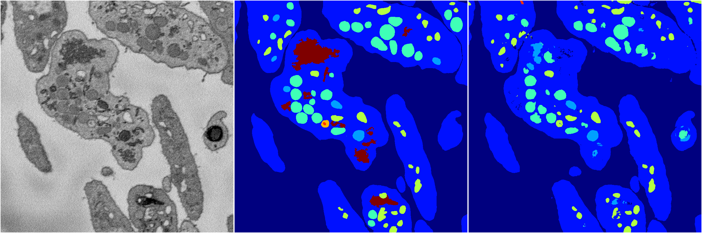</a>
<i>Click image for more details</i>

5 nets

**ari**: min 0.7582. max 0.7999. mean 0.7892.  ([best net](57/2))

**miou**: min 0.2993. max 0.4579. mean 0.3938.  ([best net](57/4))

**accuracy**: min 0.9003. max 0.9159. mean 0.9097.  ([best net](57/4))

**n_params**: min 1814012.0000. max 1814012.0000. mean 1814012.0000.  ([best net](57/0))

---

<a href="5"><h2>random_2d_ed / 1216 / 5</h2></a>
Created 21 Dec 2018, 01:15:55

<i>Click image for more details</i>

5 nets

**ari**: min 0.5933. max 0.6696. mean 0.6436.  ([best net](5/1))

**miou**: min 0.2061. max 0.2962. mean 0.2594.  ([best net](5/3))

**accuracy**: min 0.8320. max 0.8481. mean 0.8427.  ([best net](5/1))

**n_params**: min 557141.0000. max 557141.0000. mean 557141.0000.  ([best net](5/0))

---

<a href="54"><h2>random_2d_ed / 1216 / 54</h2></a>
Created 21 Dec 2018, 01:15:55

<i>Click image for more details</i>

5 nets

**ari**: min 0.5082. max 0.5596. mean 0.5461.  ([best net](54/4))

**miou**: min 0.2056. max 0.2765. mean 0.2532.  ([best net](54/4))

**accuracy**: min 0.8554. max 0.8733. mean 0.8683.  ([best net](54/4))

**n_params**: min 8115127.0000. max 8115127.0000. mean 8115127.0000.  ([best net](54/0))

---

<a href="44"><h2>random_2d_ed / 1216 / 44</h2></a>
Created 21 Dec 2018, 01:15:55

<i>Click image for more details</i>

5 nets

**ari**: min 0.6242. max 0.7638. mean 0.7225.  ([best net](44/0))

**miou**: min 0.2369. max 0.4434. mean 0.3721.  ([best net](44/0))

**accuracy**: min 0.8430. max 0.8919. mean 0.8747.  ([best net](44/0))

**n_params**: min 640959.0000. max 640959.0000. mean 640959.0000.  ([best net](44/0))

---

<a href="85"><h2>random_2d_ed / 1216 / 85</h2></a>
Created 21 Dec 2018, 01:15:55

<a href="85">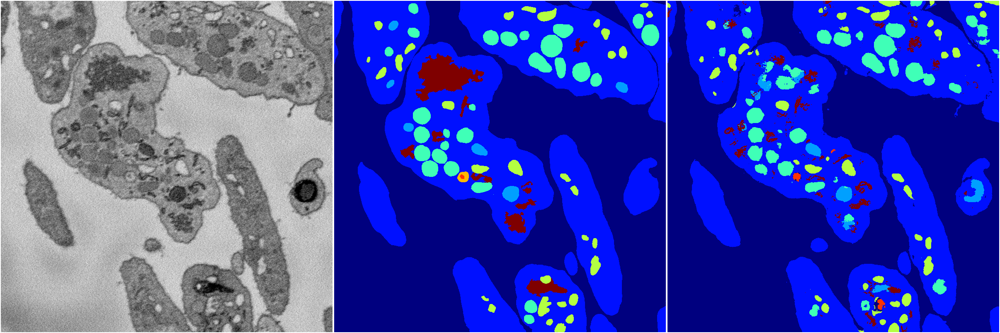</a>
<i>Click image for more details</i>

5 nets

**ari**: min 0.6962. max 0.8017. mean 0.7548.  ([best net](85/1))

**miou**: min 0.2645. max 0.4871. mean 0.3942.  ([best net](85/1))

**accuracy**: min 0.8658. max 0.9119. mean 0.8928.  ([best net](85/1))

**n_params**: min 8768049.0000. max 8768049.0000. mean 8768049.0000.  ([best net](85/0))

---

<a href="56"><h2>random_2d_ed / 1216 / 56</h2></a>
Created 21 Dec 2018, 01:15:55

<i>Click image for more details</i>

5 nets

**ari**: min 0.6106. max 0.7345. mean 0.6683.  ([best net](56/2))

**miou**: min 0.2222. max 0.3913. mean 0.3097.  ([best net](56/2))

**accuracy**: min 0.8332. max 0.8769. mean 0.8541.  ([best net](56/2))

**n_params**: min 1127592.0000. max 1127592.0000. mean 1127592.0000.  ([best net](56/0))

---

<a href="20"><h2>random_2d_ed / 1216 / 20</h2></a>
Created 21 Dec 2018, 01:15:55

<i>Click image for more details</i>

5 nets

**ari**: min 0.7593. max 0.8189. mean 0.7972.  ([best net](20/3))

**miou**: min 0.3270. max 0.5073. mean 0.4216.  ([best net](20/0))

**accuracy**: min 0.9014. max 0.9241. mean 0.9149.  ([best net](20/3))

**n_params**: min 12901938.0000. max 12901938.0000. mean 12901938.0000.  ([best net](20/0))

---

<a href="4"><h2>random_2d_ed / 1216 / 4</h2></a>
Created 21 Dec 2018, 01:15:55

<a href="4">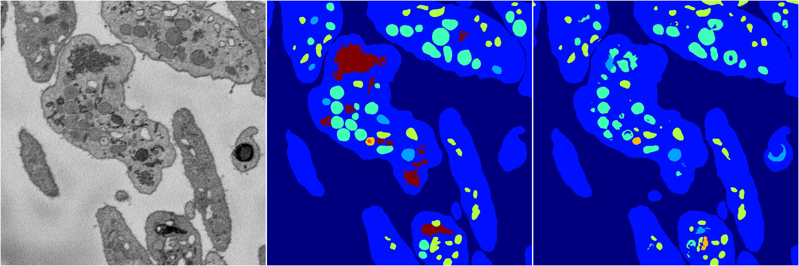</a>
<i>Click image for more details</i>

5 nets

**ari**: min 0.6802. max 0.8043. mean 0.7517.  ([best net](4/2))

**miou**: min 0.2752. max 0.4983. mean 0.3889.  ([best net](4/0))

**accuracy**: min 0.8721. max 0.9205. mean 0.8974.  ([best net](4/2))

**n_params**: min 5435039.0000. max 5435039.0000. mean 5435039.0000.  ([best net](4/0))

---

<a href="79"><h2>random_2d_ed / 1216 / 79</h2></a>
Created 21 Dec 2018, 01:15:55

<i>Click image for more details</i>

5 nets

**ari**: min 0.2861. max 0.6340. mean 0.5162.  ([best net](79/1))

**miou**: min 0.1284. max 0.2944. mean 0.2237.  ([best net](79/1))

**accuracy**: min 0.4963. max 0.8871. mean 0.7939.  ([best net](79/1))

**n_params**: min 6818564.0000. max 6818564.0000. mean 6818564.0000.  ([best net](79/0))

---

<a href="74"><h2>random_2d_ed / 1216 / 74</h2></a>
Created 21 Dec 2018, 01:15:55

<i>Click image for more details</i>

5 nets

**ari**: min 0.6333. max 0.7863. mean 0.6881.  ([best net](74/4))

**miou**: min 0.2060. max 0.3539. mean 0.2593.  ([best net](74/4))

**accuracy**: min 0.8562. max 0.9039. mean 0.8744.  ([best net](74/4))

**n_params**: min 486563.0000. max 486563.0000. mean 486563.0000.  ([best net](74/0))

---

<a href="60"><h2>random_2d_ed / 1216 / 60</h2></a>
Created 21 Dec 2018, 01:15:55

<i>Click image for more details</i>

5 nets

**ari**: min 0.5954. max 0.7255. mean 0.6798.  ([best net](60/3))

**miou**: min 0.2019. max 0.3958. mean 0.3193.  ([best net](60/4))

**accuracy**: min 0.8351. max 0.8685. mean 0.8550.  ([best net](60/3))

**n_params**: min 585512.0000. max 585512.0000. mean 585512.0000.  ([best net](60/0))

---

<a href="45"><h2>random_2d_ed / 1216 / 45</h2></a>
Created 21 Dec 2018, 01:15:55

<a href="45">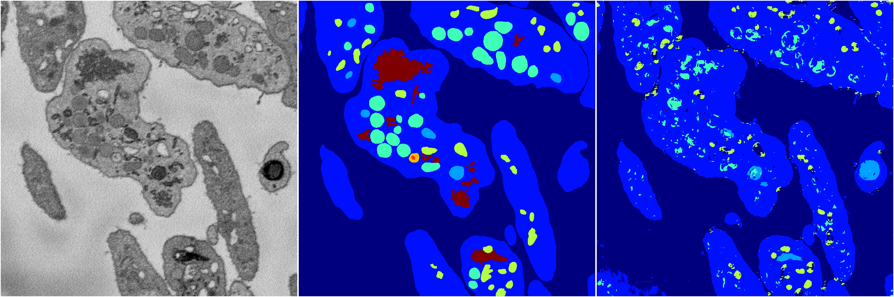</a>
<i>Click image for more details</i>

5 nets

**ari**: min 0.5610. max 0.6626. mean 0.6081.  ([best net](45/1))

**miou**: min 0.2500. max 0.2975. mean 0.2800.  ([best net](45/2))

**accuracy**: min 0.8659. max 0.8897. mean 0.8750.  ([best net](45/1))

**n_params**: min 10932082.0000. max 10932082.0000. mean 10932082.0000.  ([best net](45/0))

---

<a href="66"><h2>random_2d_ed / 1216 / 66</h2></a>
Created 21 Dec 2018, 01:15:55

<a href="66">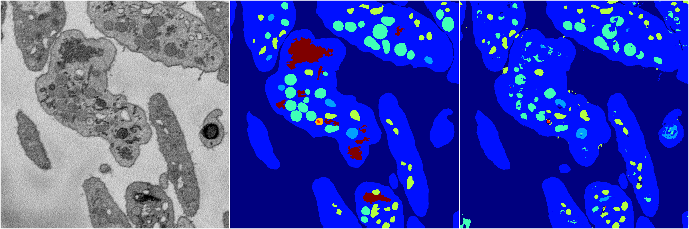</a>
<i>Click image for more details</i>

5 nets

**ari**: min 0.6753. max 0.7702. mean 0.7261.  ([best net](66/3))

**miou**: min 0.2722. max 0.4405. mean 0.3576.  ([best net](66/3))

**accuracy**: min 0.8520. max 0.8978. mean 0.8768.  ([best net](66/3))

**n_params**: min 383675.0000. max 383675.0000. mean 383675.0000.  ([best net](66/0))

---

<a href="93"><h2>random_2d_ed / 1216 / 93</h2></a>
Created 21 Dec 2018, 01:15:55

<i>Click image for more details</i>

5 nets

**ari**: min 0.5877. max 0.7392. mean 0.6749.  ([best net](93/0))

**miou**: min 0.2009. max 0.4220. mean 0.3239.  ([best net](93/3))

**accuracy**: min 0.8336. max 0.8799. mean 0.8594.  ([best net](93/0))

**n_params**: min 697429.0000. max 697429.0000. mean 697429.0000.  ([best net](93/0))

---

<a href="27"><h2>random_2d_ed / 1216 / 27</h2></a>
Created 21 Dec 2018, 01:15:55

<a href="27">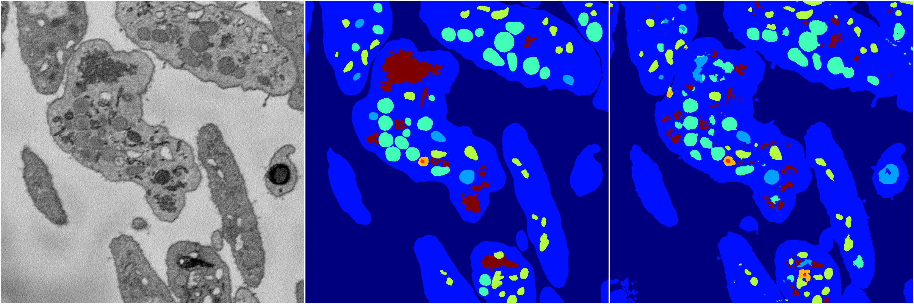</a>
<i>Click image for more details</i>

5 nets

**ari**: min 0.7109. max 0.8162. mean 0.7411.  ([best net](27/0))

**miou**: min 0.2218. max 0.5195. mean 0.3466.  ([best net](27/4))

**accuracy**: min 0.8755. max 0.9208. mean 0.8914.  ([best net](27/0))

**n_params**: min 2348709.0000. max 2348709.0000. mean 2348709.0000.  ([best net](27/0))

---

<a href="53"><h2>random_2d_ed / 1216 / 53</h2></a>
Created 21 Dec 2018, 01:15:55

<i>Click image for more details</i>

5 nets

**ari**: min 0.4887. max 0.7106. mean 0.5961.  ([best net](53/0))

**miou**: min 0.2089. max 0.4396. mean 0.3009.  ([best net](53/0))

**accuracy**: min 0.8428. max 0.9160. mean 0.8791.  ([best net](53/0))

**n_params**: min 98298755.0000. max 98298755.0000. mean 98298755.0000.  ([best net](53/0))

---

<a href="39"><h2>random_2d_ed / 1216 / 39</h2></a>
Created 21 Dec 2018, 01:15:55

<i>Click image for more details</i>

5 nets

**ari**: min 0.1455. max 0.8251. mean 0.6648.  ([best net](39/1))

**miou**: min 0.1719. max 0.5730. mean 0.3972.  ([best net](39/1))

**accuracy**: min 0.5249. max 0.9229. mean 0.8333.  ([best net](39/1))

**n_params**: min 6895552.0000. max 6895552.0000. mean 6895552.0000.  ([best net](39/0))

---

<a href="18"><h2>random_2d_ed / 1216 / 18</h2></a>
Created 21 Dec 2018, 01:15:55

<a href="18">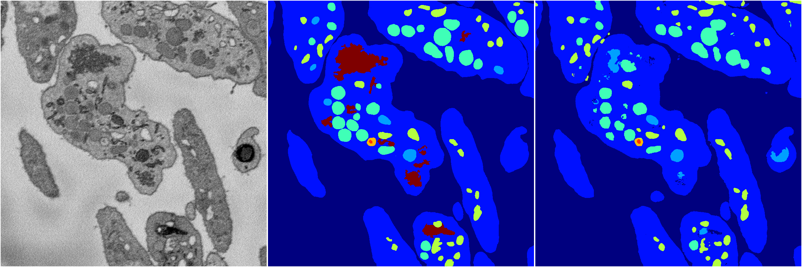</a>
<i>Click image for more details</i>

5 nets

**ari**: min 0.7159. max 0.8145. mean 0.7846.  ([best net](18/1))

**miou**: min 0.2915. max 0.5440. mean 0.4427.  ([best net](18/1))

**accuracy**: min 0.8802. max 0.9188. mean 0.9048.  ([best net](18/1))

**n_params**: min 17558442.0000. max 17558442.0000. mean 17558442.0000.  ([best net](18/0))

---

<a href="63"><h2>random_2d_ed / 1216 / 63</h2></a>
Created 21 Dec 2018, 01:15:55

<a href="63">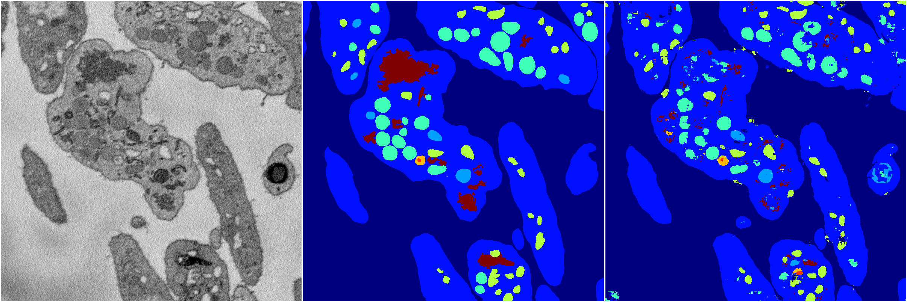</a>
<i>Click image for more details</i>

5 nets

**ari**: min 0.6098. max 0.7783. mean 0.6915.  ([best net](63/2))

**miou**: min 0.2068. max 0.4996. mean 0.3369.  ([best net](63/2))

**accuracy**: min 0.8418. max 0.9011. mean 0.8670.  ([best net](63/2))

**n_params**: min 1427077.0000. max 1427077.0000. mean 1427077.0000.  ([best net](63/0))

---

<a href="19"><h2>random_2d_ed / 1216 / 19</h2></a>
Created 21 Dec 2018, 01:15:55

<i>Click image for more details</i>

5 nets

**ari**: min 0.6400. max 0.7915. mean 0.7389.  ([best net](19/2))

**miou**: min 0.2128. max 0.3669. mean 0.3096.  ([best net](19/2))

**accuracy**: min 0.8587. max 0.9050. mean 0.8873.  ([best net](19/2))

**n_params**: min 2651161.0000. max 2651161.0000. mean 2651161.0000.  ([best net](19/0))

---

<a href="26"><h2>random_2d_ed / 1216 / 26</h2></a>
Created 21 Dec 2018, 01:15:55

<a href="26">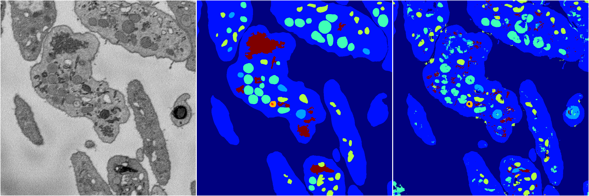</a>
<i>Click image for more details</i>

5 nets

**ari**: min 0.6943. max 0.7613. mean 0.7422.  ([best net](26/2))

**miou**: min 0.3081. max 0.4433. mean 0.3930.  ([best net](26/2))

**accuracy**: min 0.8657. max 0.8896. mean 0.8827.  ([best net](26/1))

**n_params**: min 864610.0000. max 864610.0000. mean 864610.0000.  ([best net](26/0))

---

<a href="51"><h2>random_2d_ed / 1216 / 51</h2></a>
Created 21 Dec 2018, 01:15:55

<a href="51">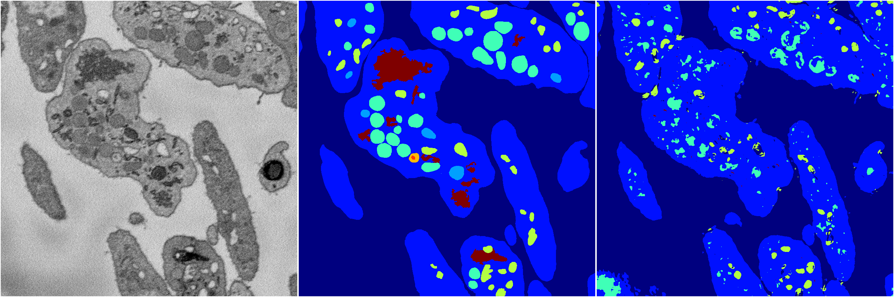</a>
<i>Click image for more details</i>

5 nets

**ari**: min 0.6081. max 0.6946. mean 0.6552.  ([best net](51/3))

**miou**: min 0.2029. max 0.2947. mean 0.2486.  ([best net](51/3))

**accuracy**: min 0.8391. max 0.8650. mean 0.8514.  ([best net](51/1))

**n_params**: min 334112.0000. max 334112.0000. mean 334112.0000.  ([best net](51/0))

---

<a href="97"><h2>random_2d_ed / 1216 / 97</h2></a>
Created 21 Dec 2018, 01:15:55

<a href="97">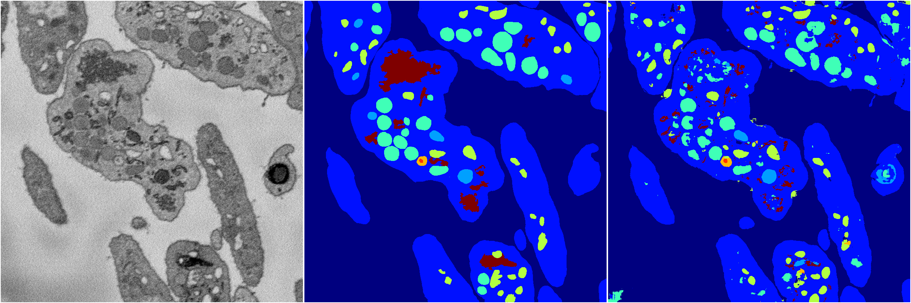</a>
<i>Click image for more details</i>

5 nets

**ari**: min 0.6074. max 0.7774. mean 0.7041.  ([best net](97/3))

**miou**: min 0.2034. max 0.5137. mean 0.3360.  ([best net](97/1))

**accuracy**: min 0.8402. max 0.8994. mean 0.8726.  ([best net](97/3))

**n_params**: min 2456801.0000. max 2456801.0000. mean 2456801.0000.  ([best net](97/0))

---

<a href="11"><h2>random_2d_ed / 1216 / 11</h2></a>
Created 21 Dec 2018, 01:15:55

<a href="11">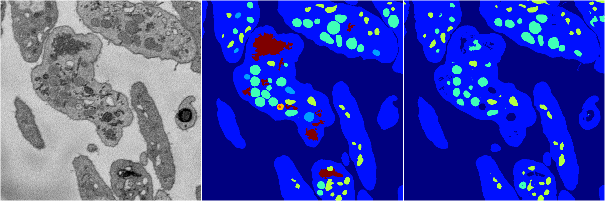</a>
<i>Click image for more details</i>

3 nets

**ari**: min 0.7590. max 0.7945. mean 0.7717.  ([best net](11/2))

**miou**: min 0.3141. max 0.3707. mean 0.3348.  ([best net](11/2))

**accuracy**: min 0.8921. max 0.9118. mean 0.9009.  ([best net](11/2))

**n_params**: min 7887743.0000. max 7887743.0000. mean 7887743.0000.  ([best net](11/3))

---

<a href="22"><h2>random_2d_ed / 1216 / 22</h2></a>
Created 21 Dec 2018, 01:15:55

<a href="22">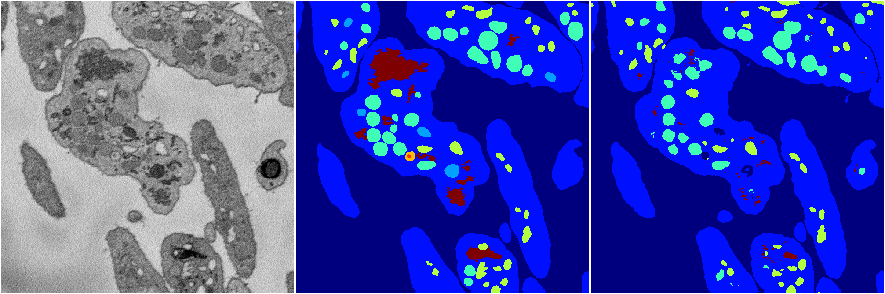</a>
<i>Click image for more details</i>

4 nets

**ari**: min 0.5660. max 0.7662. mean 0.6286.  ([best net](22/0))

**miou**: min 0.2038. max 0.3786. mean 0.2639.  ([best net](22/0))

**accuracy**: min 0.8509. max 0.9129. mean 0.8671.  ([best net](22/0))

**n_params**: min 17463387.0000. max 17463387.0000. mean 17463387.0000.  ([best net](22/0))

---

<a href="75"><h2>random_2d_ed / 1216 / 75</h2></a>
Created 21 Dec 2018, 01:15:55

<a href="75">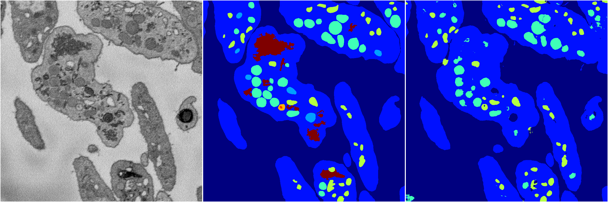</a>
<i>Click image for more details</i>

5 nets

**ari**: min 0.5327. max 0.7232. mean 0.6039.  ([best net](75/0))

**miou**: min 0.2060. max 0.3611. mean 0.2750.  ([best net](75/0))

**accuracy**: min 0.8562. max 0.9059. mean 0.8714.  ([best net](75/0))

**n_params**: min 15629314.0000. max 15629314.0000. mean 15629314.0000.  ([best net](75/0))

---

<a href="76"><h2>random_2d_ed / 1216 / 76</h2></a>
Created 21 Dec 2018, 01:15:55

<a href="76">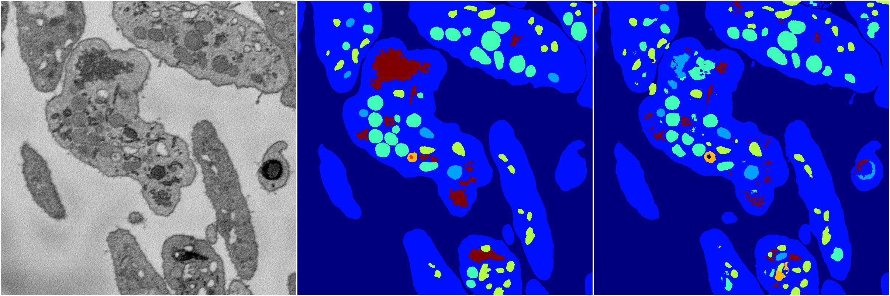</a>
<i>Click image for more details</i>

5 nets

**ari**: min 0.6721. max 0.8198. mean 0.7803.  ([best net](76/2))

**miou**: min 0.2094. max 0.4949. mean 0.3908.  ([best net](76/2))

**accuracy**: min 0.8675. max 0.9210. mean 0.9056.  ([best net](76/2))

**n_params**: min 2780189.0000. max 2780189.0000. mean 2780189.0000.  ([best net](76/0))

---

<a href="38"><h2>random_2d_ed / 1216 / 38</h2></a>
Created 21 Dec 2018, 01:15:55

<i>Click image for more details</i>

5 nets

**ari**: min 0.7734. max 0.8136. mean 0.7912.  ([best net](38/2))

**miou**: min 0.3277. max 0.5388. mean 0.3997.  ([best net](38/2))

**accuracy**: min 0.8969. max 0.9186. mean 0.9049.  ([best net](38/2))

**n_params**: min 5405088.0000. max 5405088.0000. mean 5405088.0000.  ([best net](38/0))

---

<a href="34"><h2>random_2d_ed / 1216 / 34</h2></a>
Created 21 Dec 2018, 01:15:55

<i>Click image for more details</i>

5 nets

**ari**: min 0.6574. max 0.8149. mean 0.7495.  ([best net](34/0))

**miou**: min 0.2130. max 0.5418. mean 0.3743.  ([best net](34/0))

**accuracy**: min 0.8590. max 0.9188. mean 0.8946.  ([best net](34/3))

**n_params**: min 3622216.0000. max 3622216.0000. mean 3622216.0000.  ([best net](34/0))

---

<a href="36"><h2>random_2d_ed / 1216 / 36</h2></a>
Created 21 Dec 2018, 01:15:55

<a href="36">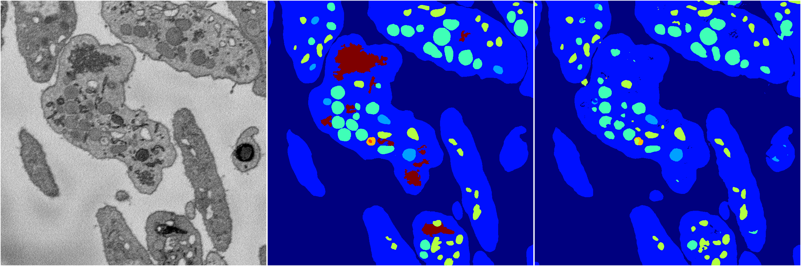</a>
<i>Click image for more details</i>

5 nets

**ari**: min 0.7425. max 0.8020. mean 0.7743.  ([best net](36/0))

**miou**: min 0.2695. max 0.5443. mean 0.3831.  ([best net](36/0))

**accuracy**: min 0.8805. max 0.9142. mean 0.8982.  ([best net](36/0))

**n_params**: min 6426283.0000. max 6426283.0000. mean 6426283.0000.  ([best net](36/0))

---

<a href="28"><h2>random_2d_ed / 1216 / 28</h2></a>
Created 21 Dec 2018, 01:15:55

<i>Click image for more details</i>

5 nets

**ari**: min 0.6014. max 0.7481. mean 0.6754.  ([best net](28/0))

**miou**: min 0.2412. max 0.3988. mean 0.3102.  ([best net](28/0))

**accuracy**: min 0.8602. max 0.9016. mean 0.8789.  ([best net](28/0))

**n_params**: min 2168126.0000. max 2168126.0000. mean 2168126.0000.  ([best net](28/0))

---

<a href="96"><h2>random_2d_ed / 1216 / 96</h2></a>
Created 21 Dec 2018, 01:15:55

<a href="96">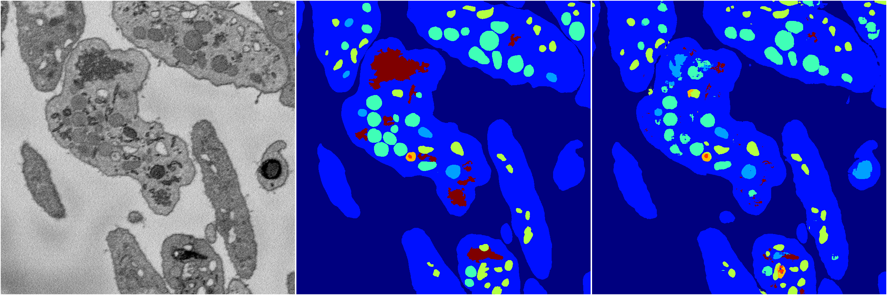</a>
<i>Click image for more details</i>

4 nets

**ari**: min 0.6071. max 0.8116. mean 0.7085.  ([best net](96/0))

**miou**: min 0.2002. max 0.5446. mean 0.3636.  ([best net](96/0))

**accuracy**: min 0.8428. max 0.9164. mean 0.8787.  ([best net](96/0))

**n_params**: min 2674582.0000. max 2674582.0000. mean 2674582.0000.  ([best net](96/0))

---

<a href="72"><h2>random_2d_ed / 1216 / 72</h2></a>
Created 21 Dec 2018, 01:15:55

<i>Click image for more details</i>

5 nets

**ari**: min 0.7060. max 0.7748. mean 0.7368.  ([best net](72/1))

**miou**: min 0.2871. max 0.4586. mean 0.3709.  ([best net](72/1))

**accuracy**: min 0.8704. max 0.8963. mean 0.8805.  ([best net](72/1))

**n_params**: min 1081852.0000. max 1081852.0000. mean 1081852.0000.  ([best net](72/0))

---

<a href="80"><h2>random_2d_ed / 1216 / 80</h2></a>
Created 21 Dec 2018, 01:15:55

<a href="80">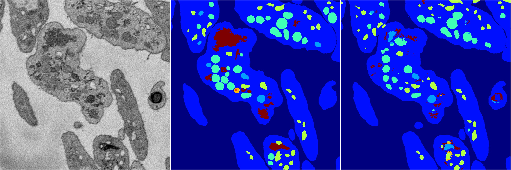</a>
<i>Click image for more details</i>

5 nets

**ari**: min 0.6350. max 0.8069. mean 0.7500.  ([best net](80/0))

**miou**: min 0.2290. max 0.5432. mean 0.4087.  ([best net](80/0))

**accuracy**: min 0.8604. max 0.9206. mean 0.8973.  ([best net](80/0))

**n_params**: min 5283596.0000. max 5283596.0000. mean 5283596.0000.  ([best net](80/0))

---

<a href="83"><h2>random_2d_ed / 1216 / 83</h2></a>
Created 21 Dec 2018, 01:15:55

<i>Click image for more details</i>

5 nets

**ari**: min 0.5870. max 0.7261. mean 0.6538.  ([best net](83/3))

**miou**: min 0.2005. max 0.3950. mean 0.2756.  ([best net](83/3))

**accuracy**: min 0.8326. max 0.8729. mean 0.8505.  ([best net](83/3))

**n_params**: min 139843.0000. max 139843.0000. mean 139843.0000.  ([best net](83/0))

---

<a href="69"><h2>random_2d_ed / 1216 / 69</h2></a>
Created 21 Dec 2018, 01:15:55

<a href="69">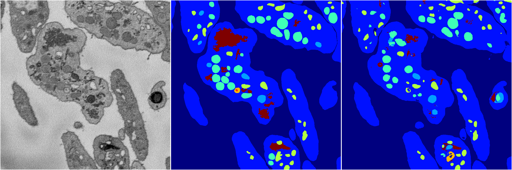</a>
<i>Click image for more details</i>

5 nets

**ari**: min 0.6424. max 0.7974. mean 0.7111.  ([best net](69/3))

**miou**: min 0.2533. max 0.4904. mean 0.3371.  ([best net](69/3))

**accuracy**: min 0.8393. max 0.9161. mean 0.8800.  ([best net](69/3))

**n_params**: min 4843704.0000. max 4843704.0000. mean 4843704.0000.  ([best net](69/0))

---

<a href="98"><h2>random_2d_ed / 1216 / 98</h2></a>
Created 21 Dec 2018, 01:15:55

<i>Click image for more details</i>

5 nets

**ari**: min 0.4603. max 0.6610. mean 0.5557.  ([best net](98/2))

**miou**: min 0.1999. max 0.3958. mean 0.2794.  ([best net](98/2))

**accuracy**: min 0.8427. max 0.9051. mean 0.8701.  ([best net](98/2))

**n_params**: min 26736133.0000. max 26736133.0000. mean 26736133.0000.  ([best net](98/0))

---

<a href="95"><h2>random_2d_ed / 1216 / 95</h2></a>
Created 21 Dec 2018, 01:15:55

<i>Click image for more details</i>

5 nets

**ari**: min 0.4684. max 0.8111. mean 0.7332.  ([best net](95/4))

**miou**: min 0.1835. max 0.5442. mean 0.4319.  ([best net](95/2))

**accuracy**: min 0.8087. max 0.9217. mean 0.8925.  ([best net](95/2))

**n_params**: min 2292994.0000. max 2292994.0000. mean 2292994.0000.  ([best net](95/0))

---

<a href="30"><h2>random_2d_ed / 1216 / 30</h2></a>
Created 21 Dec 2018, 01:15:55

<a href="30">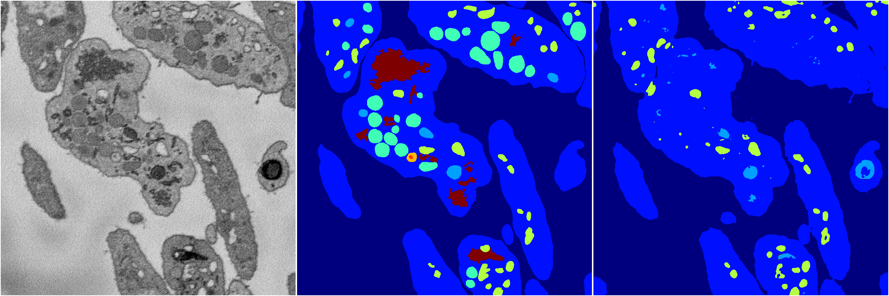</a>
<i>Click image for more details</i>

5 nets

**ari**: min 0.3476. max 0.6721. mean 0.5679.  ([best net](30/4))

**miou**: min 0.1914. max 0.3346. mean 0.2608.  ([best net](30/4))

**accuracy**: min 0.8027. max 0.8892. mean 0.8588.  ([best net](30/4))

**n_params**: min 3396005.0000. max 3396005.0000. mean 3396005.0000.  ([best net](30/0))

---

<a href="52"><h2>random_2d_ed / 1216 / 52</h2></a>
Created 21 Dec 2018, 01:15:55

<i>Click image for more details</i>

5 nets

**ari**: min 0.7326. max 0.8172. mean 0.7871.  ([best net](52/4))

**miou**: min 0.3461. max 0.5600. mean 0.4445.  ([best net](52/4))

**accuracy**: min 0.8770. max 0.9209. mean 0.9066.  ([best net](52/4))

**n_params**: min 7276783.0000. max 7276783.0000. mean 7276783.0000.  ([best net](52/0))

---

<a href="55"><h2>random_2d_ed / 1216 / 55</h2></a>
Created 21 Dec 2018, 01:15:55

<a href="55">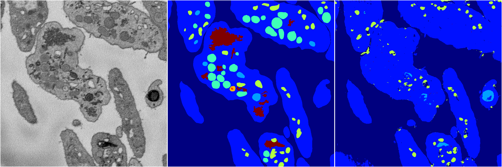</a>
<i>Click image for more details</i>

5 nets

**ari**: min 0.2263. max 0.6717. mean 0.5356.  ([best net](55/4))

**miou**: min 0.1714. max 0.2915. mean 0.2361.  ([best net](55/4))

**accuracy**: min 0.6827. max 0.8592. mean 0.8080.  ([best net](55/4))

**n_params**: min 40497.0000. max 40497.0000. mean 40497.0000.  ([best net](55/0))

---

<a href="62"><h2>random_2d_ed / 1216 / 62</h2></a>
Created 21 Dec 2018, 01:15:55

<a href="62">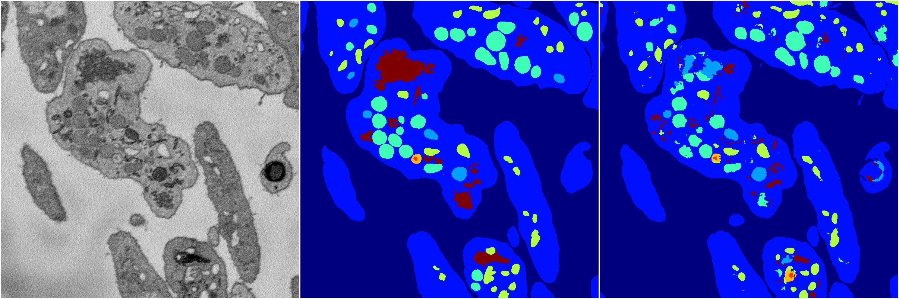</a>
<i>Click image for more details</i>

5 nets

**ari**: min 0.3626. max 0.8208. mean 0.6587.  ([best net](62/4))

**miou**: min 0.1535. max 0.5439. mean 0.3487.  ([best net](62/2))

**accuracy**: min 0.6756. max 0.9223. mean 0.8400.  ([best net](62/4))

**n_params**: min 2830694.0000. max 2830694.0000. mean 2830694.0000.  ([best net](62/0))

---

<a href="73"><h2>random_2d_ed / 1216 / 73</h2></a>
Created 21 Dec 2018, 01:15:55

<i>Click image for more details</i>

5 nets

**ari**: min 0.6037. max 0.7203. mean 0.6783.  ([best net](73/1))

**miou**: min 0.2028. max 0.3411. mean 0.2848.  ([best net](73/1))

**accuracy**: min 0.8370. max 0.8688. mean 0.8550.  ([best net](73/1))

**n_params**: min 784308.0000. max 784308.0000. mean 784308.0000.  ([best net](73/0))

---

<a href="81"><h2>random_2d_ed / 1216 / 81</h2></a>
Created 21 Dec 2018, 01:15:55

<i>Click image for more details</i>

5 nets

**ari**: min 0.5978. max 0.6753. mean 0.6411.  ([best net](81/1))

**miou**: min 0.2088. max 0.2635. mean 0.2377.  ([best net](81/2))

**accuracy**: min 0.8332. max 0.8515. mean 0.8432.  ([best net](81/2))

**n_params**: min 699416.0000. max 699416.0000. mean 699416.0000.  ([best net](81/0))

---

<a href="89"><h2>random_2d_ed / 1216 / 89</h2></a>
Created 21 Dec 2018, 01:15:55

<i>Click image for more details</i>

5 nets

**ari**: min 0.4647. max 0.7822. mean 0.6591.  ([best net](89/0))

**miou**: min 0.2168. max 0.4726. mean 0.3177.  ([best net](89/0))

**accuracy**: min 0.7911. max 0.9017. mean 0.8544.  ([best net](89/0))

**n_params**: min 2514958.0000. max 2514958.0000. mean 2514958.0000.  ([best net](89/0))

---

<a href="82"><h2>random_2d_ed / 1216 / 82</h2></a>
Created 21 Dec 2018, 01:15:55

<a href="82">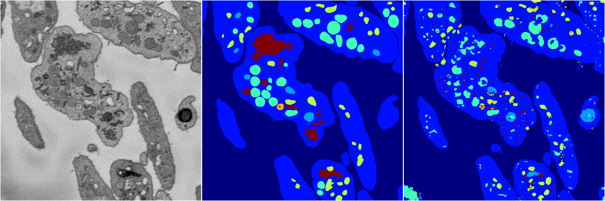</a>
<i>Click image for more details</i>

5 nets

**ari**: min 0.5967. max 0.7396. mean 0.6339.  ([best net](82/4))

**miou**: min 0.2019. max 0.4159. mean 0.2517.  ([best net](82/4))

**accuracy**: min 0.8364. max 0.8779. mean 0.8470.  ([best net](82/4))

**n_params**: min 428441.0000. max 428441.0000. mean 428441.0000.  ([best net](82/0))

---

<a href="32"><h2>random_2d_ed / 1216 / 32</h2></a>
Created 21 Dec 2018, 01:15:55

<a href="32">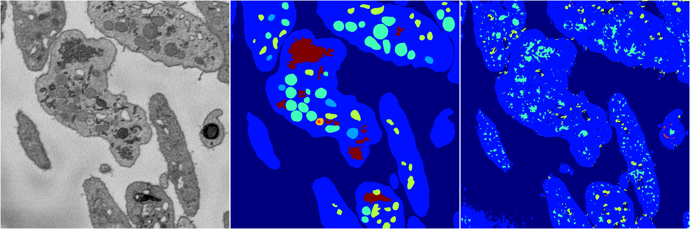</a>
<i>Click image for more details</i>

5 nets

**ari**: min 0.5819. max 0.6545. mean 0.6116.  ([best net](32/2))

**miou**: min 0.2003. max 0.2635. mean 0.2294.  ([best net](32/2))

**accuracy**: min 0.8311. max 0.8460. mean 0.8365.  ([best net](32/4))

**n_params**: min 272945.0000. max 272945.0000. mean 272945.0000.  ([best net](32/0))

---

<a href="61"><h2>random_2d_ed / 1216 / 61</h2></a>
Created 21 Dec 2018, 01:15:55

<i>Click image for more details</i>

5 nets

**ari**: min 0.6810. max 0.7972. mean 0.7677.  ([best net](61/4))

**miou**: min 0.2656. max 0.4554. mean 0.3690.  ([best net](61/4))

**accuracy**: min 0.8641. max 0.9121. mean 0.8974.  ([best net](61/4))

**n_params**: min 12713131.0000. max 12713131.0000. mean 12713131.0000.  ([best net](61/0))

---

<a href="33"><h2>random_2d_ed / 1216 / 33</h2></a>
Created 21 Dec 2018, 01:15:55

<a href="33">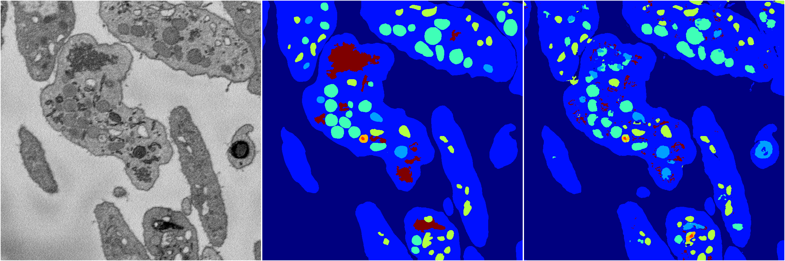</a>
<i>Click image for more details</i>

5 nets

**ari**: min 0.7264. max 0.8015. mean 0.7687.  ([best net](33/0))

**miou**: min 0.2891. max 0.5679. mean 0.4210.  ([best net](33/0))

**accuracy**: min 0.8799. max 0.9138. mean 0.8973.  ([best net](33/0))

**n_params**: min 5656350.0000. max 5656350.0000. mean 5656350.0000.  ([best net](33/0))

---

<a href="1"><h2>random_2d_ed / 1216 / 1</h2></a>
Created 21 Dec 2018, 01:15:55

<i>Click image for more details</i>

5 nets

**ari**: min 0.5444. max 0.7157. mean 0.6169.  ([best net](1/2))

**miou**: min 0.2408. max 0.4083. mean 0.2988.  ([best net](1/2))

**accuracy**: min 0.8551. max 0.9084. mean 0.8810.  ([best net](1/2))

**n_params**: min 38733217.0000. max 38733217.0000. mean 38733217.0000.  ([best net](1/0))

---

<a href="0"><h2>random_2d_ed / 1216 / 0</h2></a>
Created 21 Dec 2018, 01:15:55

<i>Click image for more details</i>

5 nets

**ari**: min 0.6323. max 0.8149. mean 0.7575.  ([best net](0/0))

**miou**: min 0.2285. max 0.5557. mean 0.4404.  ([best net](0/4))

**accuracy**: min 0.8524. max 0.9206. mean 0.8966.  ([best net](0/4))

**n_params**: min 12260483.0000. max 12260483.0000. mean 12260483.0000.  ([best net](0/0))

---

<a href="3"><h2>random_2d_ed / 1216 / 3</h2></a>
Created 21 Dec 2018, 01:15:55

<a href="3">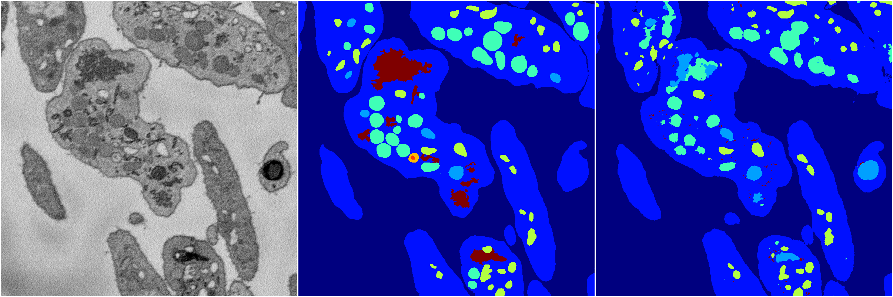</a>
<i>Click image for more details</i>

5 nets

**ari**: min 0.6047. max 0.7753. mean 0.6747.  ([best net](3/1))

**miou**: min 0.2022. max 0.4011. mean 0.2918.  ([best net](3/1))

**accuracy**: min 0.8499. max 0.9033. mean 0.8691.  ([best net](3/1))

**n_params**: min 12984814.0000. max 12984814.0000. mean 12984814.0000.  ([best net](3/0))

---

<a href="8"><h2>random_2d_ed / 1216 / 8</h2></a>
Created 21 Dec 2018, 01:15:55

<i>Click image for more details</i>

5 nets

**ari**: min 0.6368. max 0.7267. mean 0.6702.  ([best net](8/4))

**miou**: min 0.2223. max 0.4007. mean 0.2666.  ([best net](8/4))

**accuracy**: min 0.8611. max 0.8924. mean 0.8707.  ([best net](8/4))

**n_params**: min 3804672.0000. max 3804672.0000. mean 3804672.0000.  ([best net](8/0))

---

<a href="31"><h2>random_2d_ed / 1216 / 31</h2></a>
Created 21 Dec 2018, 01:15:55

<i>Click image for more details</i>

5 nets

**ari**: min 0.5971. max 0.7635. mean 0.6684.  ([best net](31/0))

**miou**: min 0.2025. max 0.4085. mean 0.2757.  ([best net](31/0))

**accuracy**: min 0.8376. max 0.8923. mean 0.8583.  ([best net](31/0))

**n_params**: min 308520.0000. max 308520.0000. mean 308520.0000.  ([best net](31/0))

---

<a href="92"><h2>random_2d_ed / 1216 / 92</h2></a>
Created 21 Dec 2018, 01:15:55

<i>Click image for more details</i>

5 nets

**ari**: min 0.6537. max 0.7863. mean 0.7452.  ([best net](92/1))

**miou**: min 0.2460. max 0.4502. mean 0.3634.  ([best net](92/3))

**accuracy**: min 0.8579. max 0.9073. mean 0.8913.  ([best net](92/1))

**n_params**: min 8234535.0000. max 8234535.0000. mean 8234535.0000.  ([best net](92/0))

---

<a href="15"><h2>random_2d_ed / 1216 / 15</h2></a>
Created 21 Dec 2018, 01:15:55

<i>Click image for more details</i>

5 nets

**ari**: min 0.7423. max 0.8032. mean 0.7757.  ([best net](15/2))

**miou**: min 0.3557. max 0.4904. mean 0.4170.  ([best net](15/2))

**accuracy**: min 0.8820. max 0.9140. mean 0.8988.  ([best net](15/2))

**n_params**: min 908780.0000. max 908780.0000. mean 908780.0000.  ([best net](15/0))

---

<a href="12"><h2>random_2d_ed / 1216 / 12</h2></a>
Created 21 Dec 2018, 01:15:55

<i>Click image for more details</i>

4 nets

**ari**: min 0.6891. max 0.8200. mean 0.7506.  ([best net](12/1))

**miou**: min 0.2741. max 0.4920. mean 0.3725.  ([best net](12/1))

**accuracy**: min 0.8637. max 0.9204. mean 0.8925.  ([best net](12/1))

**n_params**: min 4952380.0000. max 4952380.0000. mean 4952380.0000.  ([best net](12/0))

---

<a href="65"><h2>random_2d_ed / 1216 / 65</h2></a>
Created 21 Dec 2018, 01:15:55

<i>Click image for more details</i>

5 nets

**ari**: min 0.4844. max 0.5384. mean 0.5154.  ([best net](65/4))

**miou**: min 0.2024. max 0.2474. mean 0.2225.  ([best net](65/4))

**accuracy**: min 0.8471. max 0.8659. mean 0.8564.  ([best net](65/4))

**n_params**: min 11451947.0000. max 11451947.0000. mean 11451947.0000.  ([best net](65/0))

---

<a href="50"><h2>random_2d_ed / 1216 / 50</h2></a>
Created 21 Dec 2018, 01:15:55

<a href="50">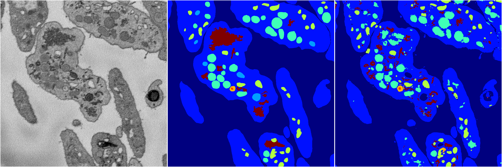</a>
<i>Click image for more details</i>

5 nets

**ari**: min 0.6290. max 0.7809. mean 0.7192.  ([best net](50/2))

**miou**: min 0.2191. max 0.4736. mean 0.3487.  ([best net](50/1))

**accuracy**: min 0.8489. max 0.8981. mean 0.8778.  ([best net](50/2))

**n_params**: min 807571.0000. max 807571.0000. mean 807571.0000.  ([best net](50/0))

---

<a href="68"><h2>random_2d_ed / 1216 / 68</h2></a>
Created 21 Dec 2018, 01:15:55

<i>Click image for more details</i>

5 nets

**ari**: min 0.6215. max 0.7545. mean 0.7036.  ([best net](68/1))

**miou**: min 0.2191. max 0.4234. mean 0.3363.  ([best net](68/4))

**accuracy**: min 0.8397. max 0.8857. mean 0.8698.  ([best net](68/1))

**n_params**: min 446595.0000. max 446595.0000. mean 446595.0000.  ([best net](68/0))

---

[Back](..)&nbsp;&nbsp;&nbsp;&nbsp;&nbsp;[Home](https://leapmanlab.github.io/snapshots)

---