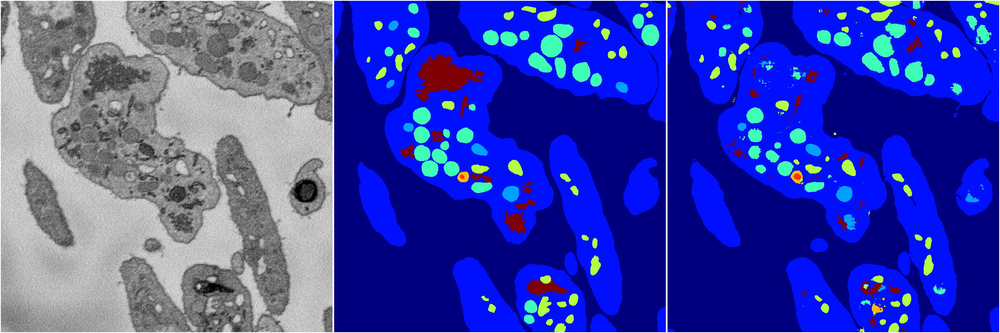
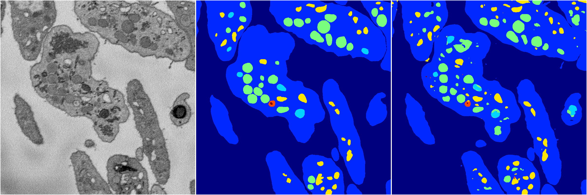

[Back](..)&nbsp;&nbsp;&nbsp;&nbsp;&nbsp;[Home](https://leapmanlab.github.io/snapshots)

---

<a href="1216"><h2>random_2d_ed / 1216</h2></a>
Created 16 Dec 2018, 15:39:23

<i>Click image for more details</i>

103 nets

**ari**: min 0.4985. max 0.8200. mean 0.7001.  ([best net](1216/12/1))

**miou**: min 0.1997. max 0.5632. mean 0.3249.  ([best net](1216/16/3))

**accuracy**: min 0.8295. max 0.9206. mean 0.8800.  ([best net](1216/0/4))

**n_params**: min 197039.0000. max 79725172.0000. mean 12013009.8641.  ([best net](1216/7/0))

---

<a href="1210"><h2>random_2d_ed / 1210</h2></a>
Created 16 Dec 2018, 15:39:21

<i>Click image for more details</i>

494 nets

**ari**: min -0.0000. max 0.8245. mean 0.7108.  ([best net](1210/67/4))

**miou**: min 0.0656. max 0.5917. mean 0.3692.  ([best net](1210/67/1))

**accuracy**: min 0.4426. max 0.9338. mean 0.8830.  ([best net](1210/31/0))

**n_params**: min 108011.0000. max 209610976.0000. mean 24415161.3138.  ([best net](1210/46/0))

---

[Back](..)&nbsp;&nbsp;&nbsp;&nbsp;&nbsp;[Home](https://leapmanlab.github.io/snapshots)

---