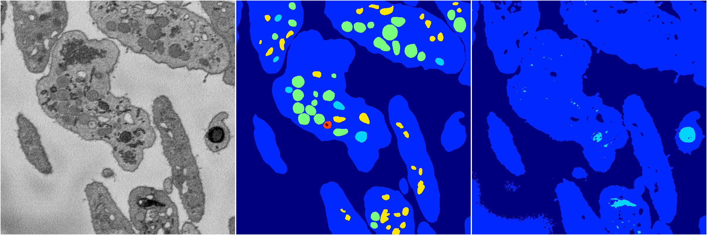

[Back](..)&nbsp;&nbsp;&nbsp;&nbsp;&nbsp;[Home](https://leapmanlab.github.io/snapshots)

---

<a href="0310"><h2>random_2d_ed / 0310</h2></a>
Created 25 Apr 2019, 14:02:43

<i>Click image for more details</i>

1 nets

**ari**: min 0.6250. max 0.6250. mean 0.6250.  ([best net](0310/5))

**miou**: min 0.2603. max 0.2603. mean 0.2603.  ([best net](0310/5))

**accuracy**: min 0.8586. max 0.8586. mean 0.8586.  ([best net](0310/5))

**n_params**: min 7767055.0000. max 7767055.0000. mean 7767055.0000.  ([best net](0310/5))

---

<a href="0306"><h2>random_2d_ed / 0306</h2></a>
Created 25 Apr 2019, 14:02:43

<i>Click image for more details</i>

1 nets

**ari**: min 0.6875. max 0.6875. mean 0.6875.  ([best net](0306/10))

**miou**: min 0.2435. max 0.2435. mean 0.2435.  ([best net](0306/10))

**accuracy**: min 0.8777. max 0.8777. mean 0.8777.  ([best net](0306/10))

**n_params**: min 275757.0000. max 275757.0000. mean 275757.0000.  ([best net](0306/10))

---

[Back](..)&nbsp;&nbsp;&nbsp;&nbsp;&nbsp;[Home](https://leapmanlab.github.io/snapshots)

---