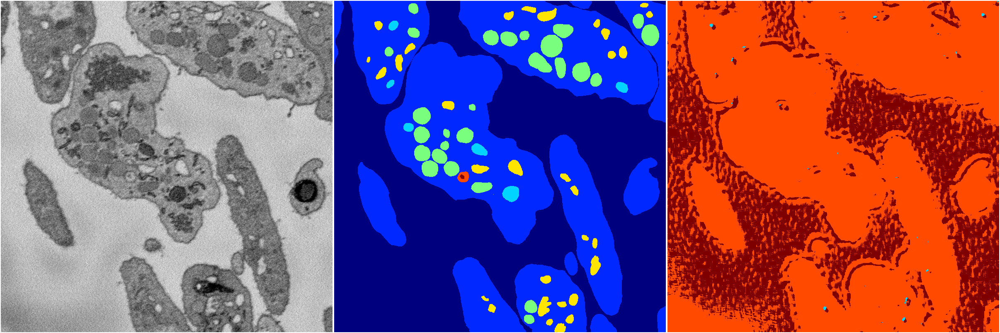
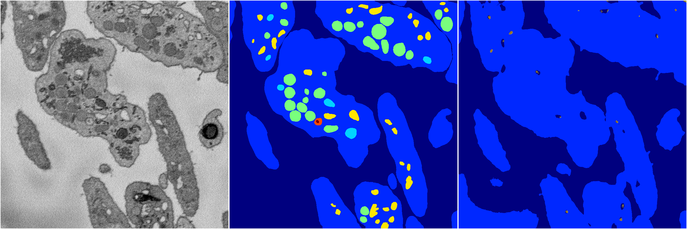
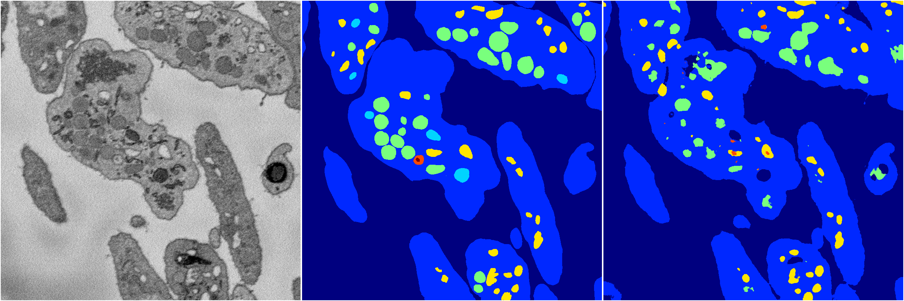

[Back](..)&nbsp;&nbsp;&nbsp;&nbsp;&nbsp;[Home](https://leapmanlab.github.io/snapshots)

---

<a href="24"><h2>random_2d_ed_dense / 0306 / 24</h2></a>
Created 29 Apr 2019, 14:47:02

<i>Click for more details</i>

**ari**: 0.2643. **miou**: 0.0002. **accuracy**: 0.0009. **n_params**: 661767.0000. 

---

<a href="23"><h2>random_2d_ed_dense / 0306 / 23</h2></a>
Created 29 Apr 2019, 14:47:02

<i>Click for more details</i>

**ari**: 0.6589. **miou**: 0.2425. **accuracy**: 0.8713. **n_params**: 2289398.0000. 

---

<a href="16"><h2>random_2d_ed_dense / 0306 / 16</h2></a>
Created 29 Apr 2019, 14:47:02

<i>Click for more details</i>

**ari**: 0.6167. **miou**: 0.2812. **accuracy**: 0.8853. **n_params**: 4223332.0000. 

---

<a href="13"><h2>random_2d_ed_dense / 0306 / 13</h2></a>
Created 29 Apr 2019, 14:47:02

<i>Click for more details</i>

**ari**: 0.7797. **miou**: 0.3855. **accuracy**: 0.9153. **n_params**: 6357218.0000. 

---

[Back](..)&nbsp;&nbsp;&nbsp;&nbsp;&nbsp;[Home](https://leapmanlab.github.io/snapshots)

---