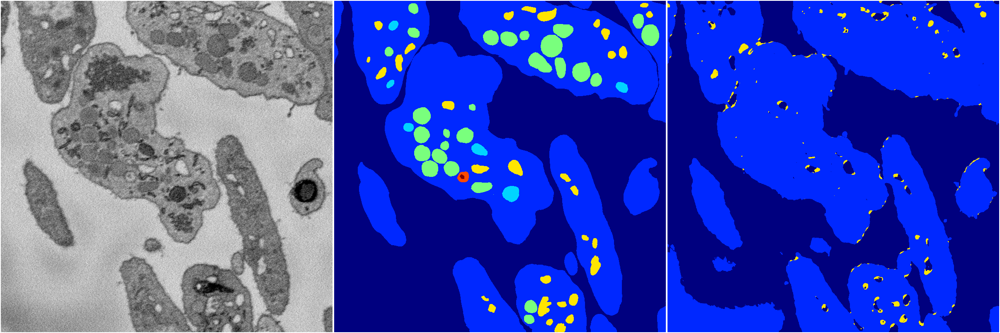
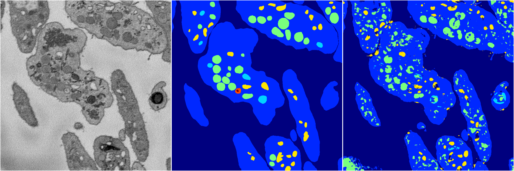

[Back](..)&nbsp;&nbsp;&nbsp;&nbsp;&nbsp;[Home](https://leapmanlab.github.io/snapshots)

---

<a href="1"><h2>random_2d_ed_dense / 0408 / 0 / 1</h2></a>
Created 08 Apr 2019, 16:23:19

<i>Click for more details</i>

**ari**: 0.6634. **miou**: 0.2663. **accuracy**: 0.8709. **n_params**: 198864.0000. 

---

<a href="0"><h2>random_2d_ed_dense / 0408 / 0 / 0</h2></a>
Created 08 Apr 2019, 16:23:18

<i>Click for more details</i>

**ari**: 0.7508. **miou**: 0.4087. **accuracy**: 0.8924. **n_params**: 198864.0000. 

---

[Back](..)&nbsp;&nbsp;&nbsp;&nbsp;&nbsp;[Home](https://leapmanlab.github.io/snapshots)

---