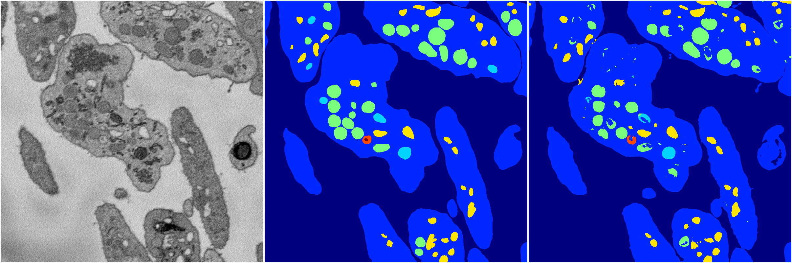

[Back](..)&nbsp;&nbsp;&nbsp;&nbsp;&nbsp;[Home](https://leapmanlab.github.io/snapshots)

---

<a href="1"><h2>random_2d_ed_dense / 0410 / 0 / 1</h2></a>
Created 12 Apr 2019, 15:10:13

<i>Click for more details</i>

**ari**: 0.8300. **miou**: 0.6110. **accuracy**: 0.9374. **n_params**: 17217594.0000. 

---

<a href="0"><h2>random_2d_ed_dense / 0410 / 0 / 0</h2></a>
Created 12 Apr 2019, 15:10:13

<i>Click for more details</i>

**ari**: 0.8279. **miou**: 0.6009. **accuracy**: 0.9378. **n_params**: 17217594.0000. 

---

[Back](..)&nbsp;&nbsp;&nbsp;&nbsp;&nbsp;[Home](https://leapmanlab.github.io/snapshots)

---