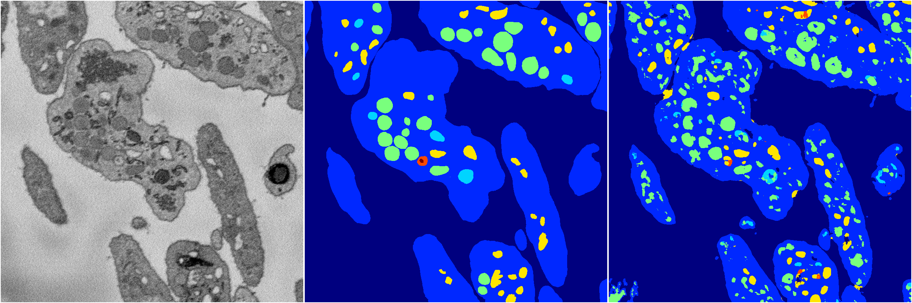

[Back](..)&nbsp;&nbsp;&nbsp;&nbsp;&nbsp;[Home](https://leapmanlab.github.io/snapshots)

---

<a href="0"><h2>random_2d_ed_dense / 0410 / 1 / 0</h2></a>
Created 20 Apr 2019, 00:17:07

<i>Click for more details</i>

**ari**: 0.7588. **miou**: 0.4599. **accuracy**: 0.8957. **n_params**: 10562616.0000. 

---

<a href="1"><h2>random_2d_ed_dense / 0410 / 1 / 1</h2></a>
Created 20 Apr 2019, 00:17:07

<i>Click for more details</i>

**ari**: 0.8179. **miou**: 0.6033. **accuracy**: 0.9311. **n_params**: 10562616.0000. 

---

[Back](..)&nbsp;&nbsp;&nbsp;&nbsp;&nbsp;[Home](https://leapmanlab.github.io/snapshots)

---