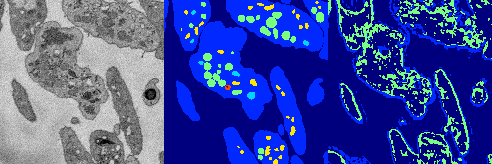

[Back](..)&nbsp;&nbsp;&nbsp;&nbsp;&nbsp;[Home](https://leapmanlab.github.io/snapshots)

---

<a href="0"><h2>random_2d_ed_dense / 0410 / 10 / 0</h2></a>
Created 25 Apr 2019, 14:02:44

<i>Click for more details</i>

**ari**: 0.0669. **miou**: 0.0988. **accuracy**: 0.4827. **n_params**: 2428690.0000. 

---

<a href="1"><h2>random_2d_ed_dense / 0410 / 10 / 1</h2></a>
Created 25 Apr 2019, 14:02:44

<i>Click for more details</i>

**ari**: 0.6506. **miou**: 0.2749. **accuracy**: 0.8637. **n_params**: 2428690.0000. 

---

[Back](..)&nbsp;&nbsp;&nbsp;&nbsp;&nbsp;[Home](https://leapmanlab.github.io/snapshots)

---