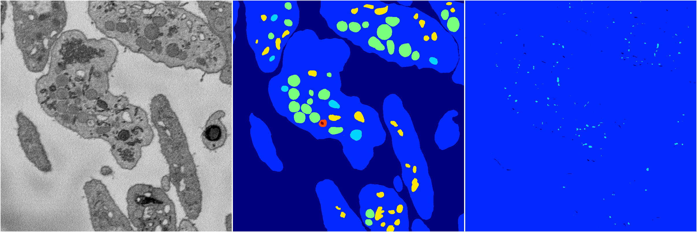

[Back](..)&nbsp;&nbsp;&nbsp;&nbsp;&nbsp;[Home](https://leapmanlab.github.io/snapshots)

---

<a href="1"><h2>random_2d_ed_dense / 0410 / 101 / 1</h2></a>
Created 16 Apr 2019, 17:08:28

<i>Click for more details</i>

**ari**: 0.2862. **miou**: 0.1835. **accuracy**: 0.7115. **n_params**: 996605.0000. 

---

<a href="0"><h2>random_2d_ed_dense / 0410 / 101 / 0</h2></a>
Created 16 Apr 2019, 17:08:28

<i>Click for more details</i>

**ari**: -0.0008. **miou**: 0.0710. **accuracy**: 0.4965. **n_params**: 996605.0000. 

---

[Back](..)&nbsp;&nbsp;&nbsp;&nbsp;&nbsp;[Home](https://leapmanlab.github.io/snapshots)

---