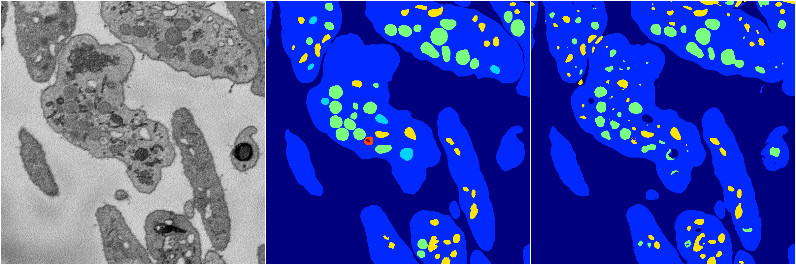

[Back](..)&nbsp;&nbsp;&nbsp;&nbsp;&nbsp;[Home](https://leapmanlab.github.io/snapshots)

---

<a href="1"><h2>random_2d_ed_dense / 0410 / 108 / 1</h2></a>
Created 07 May 2019, 10:52:50

<i>Click for more details</i>

**ari**: 0.8233. **miou**: 0.6063. **accuracy**: 0.9342. **n_params**: 6540929.0000. 

---

<a href="0"><h2>random_2d_ed_dense / 0410 / 108 / 0</h2></a>
Created 07 May 2019, 10:52:50

<i>Click for more details</i>

**ari**: 0.8098. **miou**: 0.4261. **accuracy**: 0.9235. **n_params**: 6540929.0000. 

---

[Back](..)&nbsp;&nbsp;&nbsp;&nbsp;&nbsp;[Home](https://leapmanlab.github.io/snapshots)

---