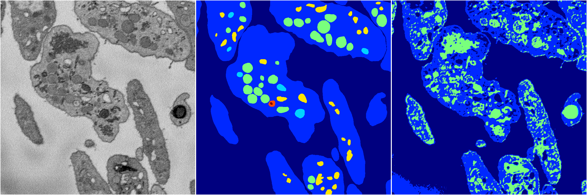

[Back](..)&nbsp;&nbsp;&nbsp;&nbsp;&nbsp;[Home](https://leapmanlab.github.io/snapshots)

---

<a href="1"><h2>random_2d_ed_dense / 0410 / 11 / 1</h2></a>
Created 18 Apr 2019, 16:40:57

<i>Click for more details</i>

**ari**: 0.4524. **miou**: 0.2240. **accuracy**: 0.8055. **n_params**: 983425.0000. 

---

<a href="0"><h2>random_2d_ed_dense / 0410 / 11 / 0</h2></a>
Created 18 Apr 2019, 16:40:57

<i>Click for more details</i>

**ari**: 0.5412. **miou**: 0.2238. **accuracy**: 0.7576. **n_params**: 983425.0000. 

---

[Back](..)&nbsp;&nbsp;&nbsp;&nbsp;&nbsp;[Home](https://leapmanlab.github.io/snapshots)

---