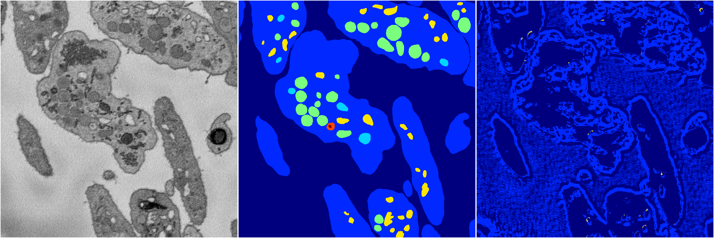

[Back](..)&nbsp;&nbsp;&nbsp;&nbsp;&nbsp;[Home](https://leapmanlab.github.io/snapshots)

---

<a href="0"><h2>random_2d_ed_dense / 0410 / 117 / 0</h2></a>
Created 20 Apr 2019, 00:17:08

<i>Click for more details</i>

**ari**: 0.1163. **miou**: 0.1278. **accuracy**: 0.5209. **n_params**: 56320.0000. 

---

<a href="1"><h2>random_2d_ed_dense / 0410 / 117 / 1</h2></a>
Created 20 Apr 2019, 00:17:08

<i>Click for more details</i>

**ari**: -0.0107. **miou**: 0.0859. **accuracy**: 0.4371. **n_params**: 56320.0000. 

---

[Back](..)&nbsp;&nbsp;&nbsp;&nbsp;&nbsp;[Home](https://leapmanlab.github.io/snapshots)

---