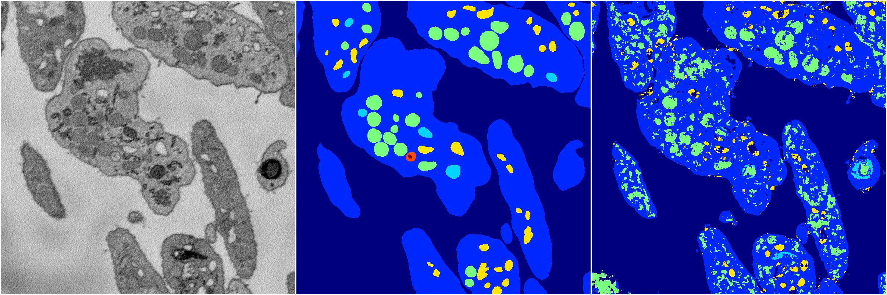

[Back](..)&nbsp;&nbsp;&nbsp;&nbsp;&nbsp;[Home](https://leapmanlab.github.io/snapshots)

---

<a href="1"><h2>random_2d_ed_dense / 0410 / 128 / 1</h2></a>
Created 18 Apr 2019, 16:40:58

<i>Click for more details</i>

**ari**: 0.6698. **miou**: 0.3444. **accuracy**: 0.8433. **n_params**: 522489.0000. 

---

<a href="0"><h2>random_2d_ed_dense / 0410 / 128 / 0</h2></a>
Created 18 Apr 2019, 16:40:58

<i>Click for more details</i>

**ari**: 0.6940. **miou**: 0.3528. **accuracy**: 0.8632. **n_params**: 522489.0000. 

---

[Back](..)&nbsp;&nbsp;&nbsp;&nbsp;&nbsp;[Home](https://leapmanlab.github.io/snapshots)

---