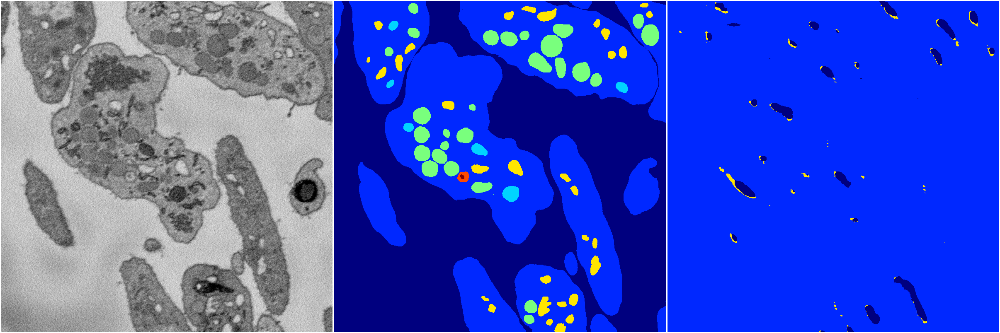

[Back](..)&nbsp;&nbsp;&nbsp;&nbsp;&nbsp;[Home](https://leapmanlab.github.io/snapshots)

---

<a href="1"><h2>random_2d_ed_dense / 0410 / 136 / 1</h2></a>
Created 16 Apr 2019, 17:08:29

<i>Click for more details</i>

**ari**: 0.6660. **miou**: 0.2502. **accuracy**: 0.8798. **n_params**: 5498341.0000. 

---

<a href="0"><h2>random_2d_ed_dense / 0410 / 136 / 0</h2></a>
Created 16 Apr 2019, 17:08:29

<i>Click for more details</i>

**ari**: 0.0018. **miou**: 0.0682. **accuracy**: 0.4617. **n_params**: 5498341.0000. 

---

[Back](..)&nbsp;&nbsp;&nbsp;&nbsp;&nbsp;[Home](https://leapmanlab.github.io/snapshots)

---