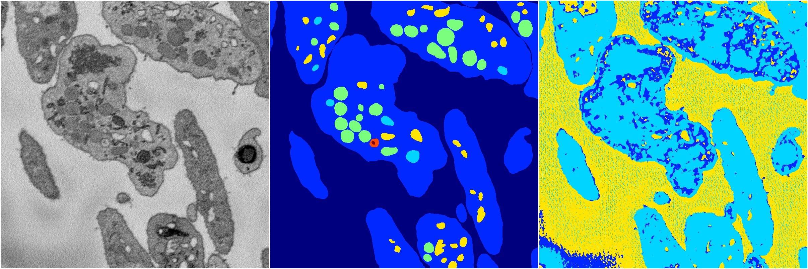

[Back](..)&nbsp;&nbsp;&nbsp;&nbsp;&nbsp;[Home](https://leapmanlab.github.io/snapshots)

---

<a href="0"><h2>random_2d_ed_dense / 0410 / 137 / 0</h2></a>
Created 25 Apr 2019, 14:02:45

<i>Click for more details</i>

**ari**: 0.4056. **miou**: 0.0321. **accuracy**: 0.1118. **n_params**: 954843.0000. 

---

<a href="1"><h2>random_2d_ed_dense / 0410 / 137 / 1</h2></a>
Created 25 Apr 2019, 14:02:45

<i>Click for more details</i>

**ari**: 0.4378. **miou**: 0.2005. **accuracy**: 0.7765. **n_params**: 954843.0000. 

---

[Back](..)&nbsp;&nbsp;&nbsp;&nbsp;&nbsp;[Home](https://leapmanlab.github.io/snapshots)

---