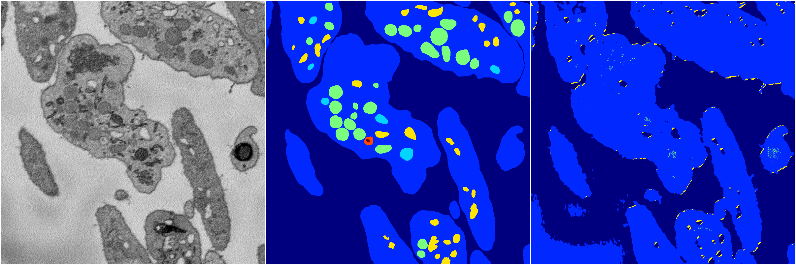

[Back](..)&nbsp;&nbsp;&nbsp;&nbsp;&nbsp;[Home](https://leapmanlab.github.io/snapshots)

---

<a href="1"><h2>random_2d_ed_dense / 0410 / 145 / 1</h2></a>
Created 25 Apr 2019, 14:02:45

<i>Click for more details</i>

**ari**: 0.6386. **miou**: 0.2476. **accuracy**: 0.8603. **n_params**: 220112.0000. 

---

<a href="0"><h2>random_2d_ed_dense / 0410 / 145 / 0</h2></a>
Created 25 Apr 2019, 14:02:45

<i>Click for more details</i>

**ari**: 0.6656. **miou**: 0.2590. **accuracy**: 0.8696. **n_params**: 220112.0000. 

---

[Back](..)&nbsp;&nbsp;&nbsp;&nbsp;&nbsp;[Home](https://leapmanlab.github.io/snapshots)

---