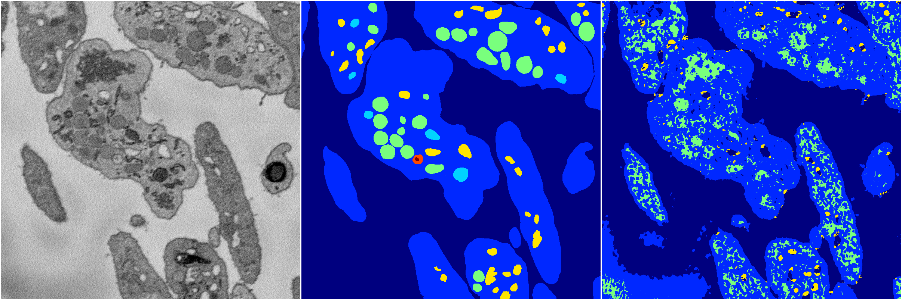

[Back](..)&nbsp;&nbsp;&nbsp;&nbsp;&nbsp;[Home](https://leapmanlab.github.io/snapshots)

---

<a href="1"><h2>random_2d_ed_dense / 0410 / 164 / 1</h2></a>
Created 18 Apr 2019, 16:40:58

<i>Click for more details</i>

**ari**: 0.7411. **miou**: 0.4390. **accuracy**: 0.8868. **n_params**: 422620.0000. 

---

<a href="0"><h2>random_2d_ed_dense / 0410 / 164 / 0</h2></a>
Created 18 Apr 2019, 16:40:58

<i>Click for more details</i>

**ari**: 0.6163. **miou**: 0.2853. **accuracy**: 0.8268. **n_params**: 422620.0000. 

---

[Back](..)&nbsp;&nbsp;&nbsp;&nbsp;&nbsp;[Home](https://leapmanlab.github.io/snapshots)

---