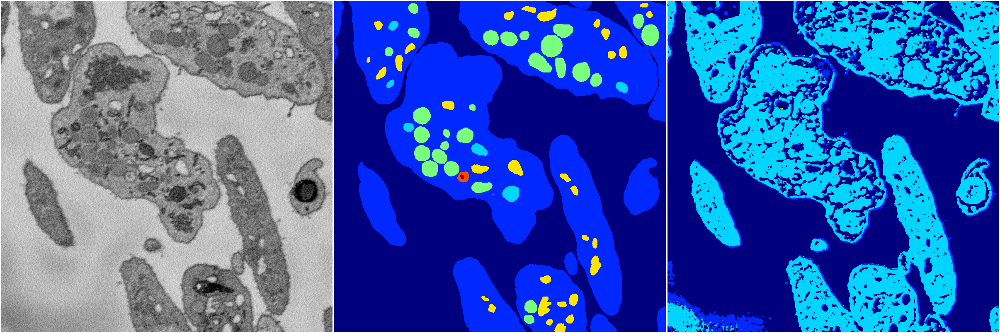

[Back](..)&nbsp;&nbsp;&nbsp;&nbsp;&nbsp;[Home](https://leapmanlab.github.io/snapshots)

---

<a href="1"><h2>random_2d_ed_dense / 0410 / 172 / 1</h2></a>
Created 29 Apr 2019, 14:47:28

<i>Click for more details</i>

**ari**: 0.4169. **miou**: 0.1167. **accuracy**: 0.4399. **n_params**: 2702581.0000. 

---

<a href="0"><h2>random_2d_ed_dense / 0410 / 172 / 0</h2></a>
Created 29 Apr 2019, 14:47:28

<i>Click for more details</i>

**ari**: 0.6049. **miou**: 0.2864. **accuracy**: 0.8495. **n_params**: 2702581.0000. 

---

[Back](..)&nbsp;&nbsp;&nbsp;&nbsp;&nbsp;[Home](https://leapmanlab.github.io/snapshots)

---