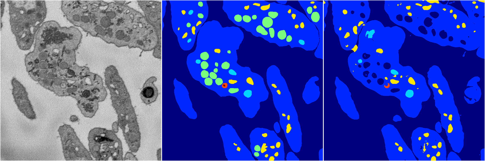

[Back](..)&nbsp;&nbsp;&nbsp;&nbsp;&nbsp;[Home](https://leapmanlab.github.io/snapshots)

---

<a href="1"><h2>random_2d_ed_dense / 0410 / 18 / 1</h2></a>
Created 29 Apr 2019, 14:47:06

<i>Click for more details</i>

**ari**: 0.8141. **miou**: 0.4596. **accuracy**: 0.9313. **n_params**: 6170724.0000. 

---

<a href="0"><h2>random_2d_ed_dense / 0410 / 18 / 0</h2></a>
Created 29 Apr 2019, 14:47:05

<i>Click for more details</i>

**ari**: 0.7986. **miou**: 0.4433. **accuracy**: 0.9233. **n_params**: 6170724.0000. 

---

[Back](..)&nbsp;&nbsp;&nbsp;&nbsp;&nbsp;[Home](https://leapmanlab.github.io/snapshots)

---