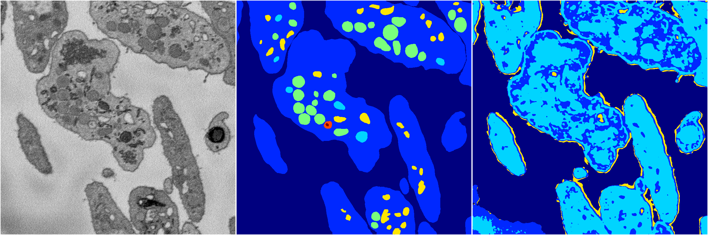

[Back](..)&nbsp;&nbsp;&nbsp;&nbsp;&nbsp;[Home](https://leapmanlab.github.io/snapshots)

---

<a href="0"><h2>random_2d_ed_dense / 0410 / 189 / 0</h2></a>
Created 25 Apr 2019, 14:02:45

<i>Click for more details</i>

**ari**: 0.5241. **miou**: 0.1488. **accuracy**: 0.4930. **n_params**: 1024013.0000. 

---

<a href="1"><h2>random_2d_ed_dense / 0410 / 189 / 1</h2></a>
Created 25 Apr 2019, 14:02:45

<i>Click for more details</i>

**ari**: 0.5063. **miou**: 0.2173. **accuracy**: 0.8284. **n_params**: 1024013.0000. 

---

[Back](..)&nbsp;&nbsp;&nbsp;&nbsp;&nbsp;[Home](https://leapmanlab.github.io/snapshots)

---