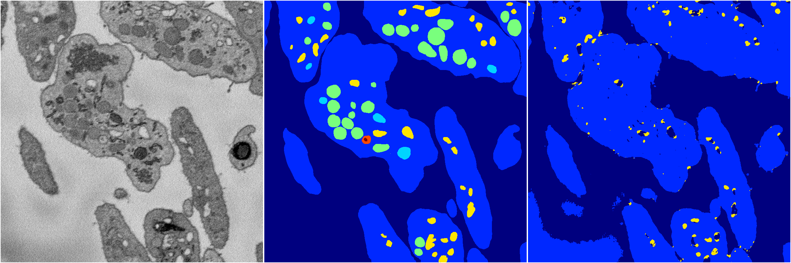

[Back](..)&nbsp;&nbsp;&nbsp;&nbsp;&nbsp;[Home](https://leapmanlab.github.io/snapshots)

---

<a href="0"><h2>random_2d_ed_dense / 0410 / 198 / 0</h2></a>
Created 29 Apr 2019, 14:47:33

<i>Click for more details</i>

**ari**: 0.7126. **miou**: 0.3765. **accuracy**: 0.8752. **n_params**: 200815.0000. 

---

<a href="1"><h2>random_2d_ed_dense / 0410 / 198 / 1</h2></a>
Created 29 Apr 2019, 14:47:33

<i>Click for more details</i>

**ari**: 0.6692. **miou**: 0.2788. **accuracy**: 0.8727. **n_params**: 200815.0000. 

---

[Back](..)&nbsp;&nbsp;&nbsp;&nbsp;&nbsp;[Home](https://leapmanlab.github.io/snapshots)

---