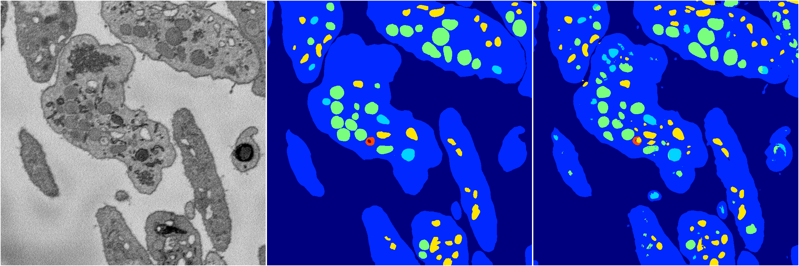

[Back](..)&nbsp;&nbsp;&nbsp;&nbsp;&nbsp;[Home](https://leapmanlab.github.io/snapshots)

---

<a href="1"><h2>random_2d_ed_dense / 0410 / 20 / 1</h2></a>
Created 16 Apr 2019, 17:08:25

<i>Click for more details</i>

**ari**: 0.8145. **miou**: 0.5103. **accuracy**: 0.9279. **n_params**: 3278069.0000. 

---

<a href="0"><h2>random_2d_ed_dense / 0410 / 20 / 0</h2></a>
Created 16 Apr 2019, 17:08:25

<i>Click for more details</i>

**ari**: 0.8068. **miou**: 0.5356. **accuracy**: 0.9250. **n_params**: 3278069.0000. 

---

[Back](..)&nbsp;&nbsp;&nbsp;&nbsp;&nbsp;[Home](https://leapmanlab.github.io/snapshots)

---