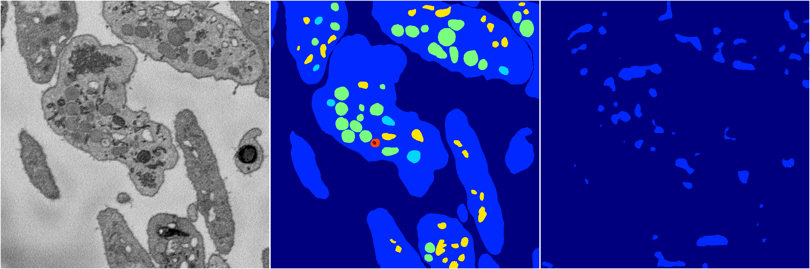

[Back](..)&nbsp;&nbsp;&nbsp;&nbsp;&nbsp;[Home](https://leapmanlab.github.io/snapshots)

---

<a href="1"><h2>random_2d_ed_dense / 0410 / 27 / 1</h2></a>
Created 16 Apr 2019, 17:08:25

<i>Click for more details</i>

**ari**: 0.1446. **miou**: 0.0991. **accuracy**: 0.4228. **n_params**: 2112798.0000. 

---

<a href="0"><h2>random_2d_ed_dense / 0410 / 27 / 0</h2></a>
Created 16 Apr 2019, 17:08:25

<i>Click for more details</i>

**ari**: 0.0163. **miou**: 0.0804. **accuracy**: 0.4930. **n_params**: 2112798.0000. 

---

[Back](..)&nbsp;&nbsp;&nbsp;&nbsp;&nbsp;[Home](https://leapmanlab.github.io/snapshots)

---