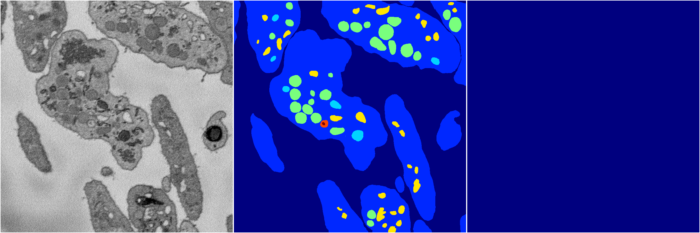

[Back](..)&nbsp;&nbsp;&nbsp;&nbsp;&nbsp;[Home](https://leapmanlab.github.io/snapshots)

---

<a href="0"><h2>random_2d_ed_dense / 0410 / 279 / 0</h2></a>
Created 12 Apr 2019, 15:10:54

<i>Click for more details</i>

**ari**: -0.0013. **miou**: 0.0612. **accuracy**: 0.4243. **n_params**: 1602801.0000. 

---

<a href="1"><h2>random_2d_ed_dense / 0410 / 279 / 1</h2></a>
Created 12 Apr 2019, 15:10:53

<i>Click for more details</i>

**ari**: 0.0000. **miou**: 0.0602. **accuracy**: 0.4215. **n_params**: 1602801.0000. 

---

[Back](..)&nbsp;&nbsp;&nbsp;&nbsp;&nbsp;[Home](https://leapmanlab.github.io/snapshots)

---