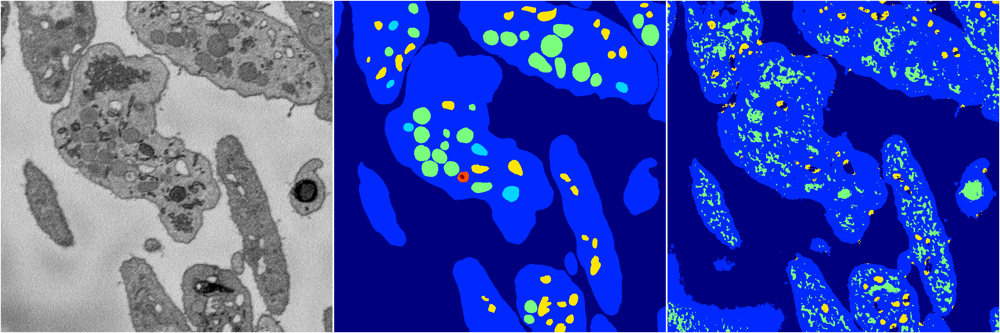

[Back](..)&nbsp;&nbsp;&nbsp;&nbsp;&nbsp;[Home](https://leapmanlab.github.io/snapshots)

---

<a href="0"><h2>random_2d_ed_dense / 0410 / 288 / 0</h2></a>
Created 20 Apr 2019, 00:17:08

<i>Click for more details</i>

**ari**: 0.6431. **miou**: 0.2980. **accuracy**: 0.8399. **n_params**: 744538.0000. 

---

<a href="1"><h2>random_2d_ed_dense / 0410 / 288 / 1</h2></a>
Created 20 Apr 2019, 00:17:08

<i>Click for more details</i>

**ari**: 0.7262. **miou**: 0.4008. **accuracy**: 0.8801. **n_params**: 744538.0000. 

---

[Back](..)&nbsp;&nbsp;&nbsp;&nbsp;&nbsp;[Home](https://leapmanlab.github.io/snapshots)

---