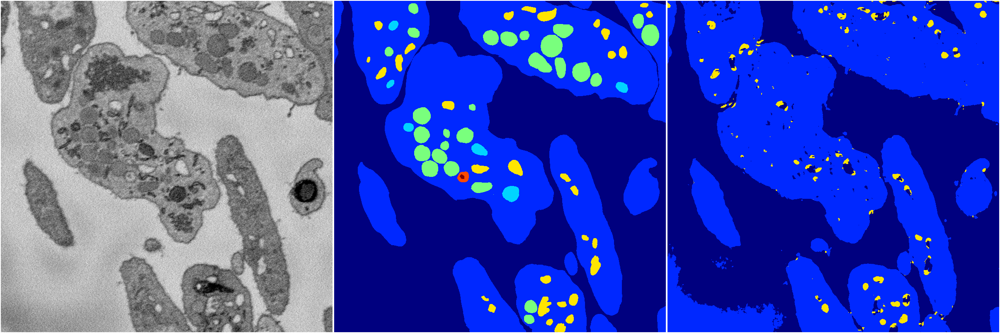

[Back](..)&nbsp;&nbsp;&nbsp;&nbsp;&nbsp;[Home](https://leapmanlab.github.io/snapshots)

---

<a href="1"><h2>random_2d_ed_dense / 0410 / 36 / 1</h2></a>
Created 25 Apr 2019, 13:50:19

<i>Click for more details</i>

**ari**: 0.7136. **miou**: 0.3318. **accuracy**: 0.8750. **n_params**: 115247.0000. 

---

<a href="0"><h2>random_2d_ed_dense / 0410 / 36 / 0</h2></a>
Created 25 Apr 2019, 13:50:19

<i>Click for more details</i>

**ari**: 0.6835. **miou**: 0.2870. **accuracy**: 0.8770. **n_params**: 115247.0000. 

---

[Back](..)&nbsp;&nbsp;&nbsp;&nbsp;&nbsp;[Home](https://leapmanlab.github.io/snapshots)

---