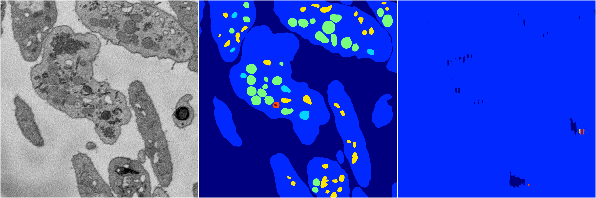

[Back](..)&nbsp;&nbsp;&nbsp;&nbsp;&nbsp;[Home](https://leapmanlab.github.io/snapshots)

---

<a href="1"><h2>random_2d_ed_dense / 0410 / 46 / 1</h2></a>
Created 25 Apr 2019, 13:50:20

<i>Click for more details</i>

**ari**: -0.0022. **miou**: 0.0691. **accuracy**: 0.4577. **n_params**: 3269626.0000. 

---

<a href="0"><h2>random_2d_ed_dense / 0410 / 46 / 0</h2></a>
Created 25 Apr 2019, 13:50:20

<i>Click for more details</i>

**ari**: 0.0009. **miou**: 0.0654. **accuracy**: 0.4566. **n_params**: 3269626.0000. 

---

[Back](..)&nbsp;&nbsp;&nbsp;&nbsp;&nbsp;[Home](https://leapmanlab.github.io/snapshots)

---