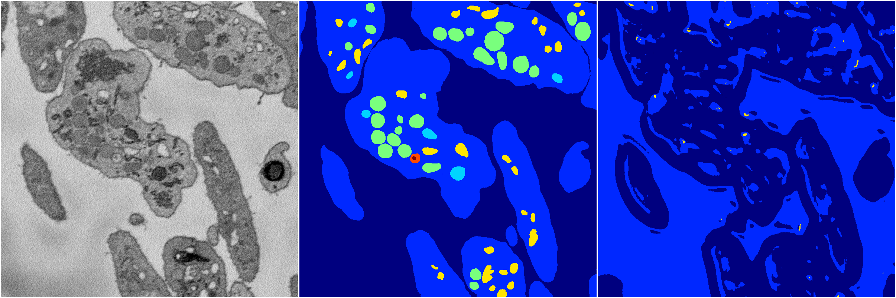

[Back](..)&nbsp;&nbsp;&nbsp;&nbsp;&nbsp;[Home](https://leapmanlab.github.io/snapshots)

---

<a href="1"><h2>random_2d_ed_dense / 0410 / 47 / 1</h2></a>
Created 20 Apr 2019, 00:17:07

<i>Click for more details</i>

**ari**: 0.2018. **miou**: 0.0390. **accuracy**: 0.2342. **n_params**: 7840065.0000. 

---

<a href="0"><h2>random_2d_ed_dense / 0410 / 47 / 0</h2></a>
Created 20 Apr 2019, 00:17:07

<i>Click for more details</i>

**ari**: 0.0000. **miou**: 0.0666. **accuracy**: 0.4664. **n_params**: 7840065.0000. 

---

[Back](..)&nbsp;&nbsp;&nbsp;&nbsp;&nbsp;[Home](https://leapmanlab.github.io/snapshots)

---