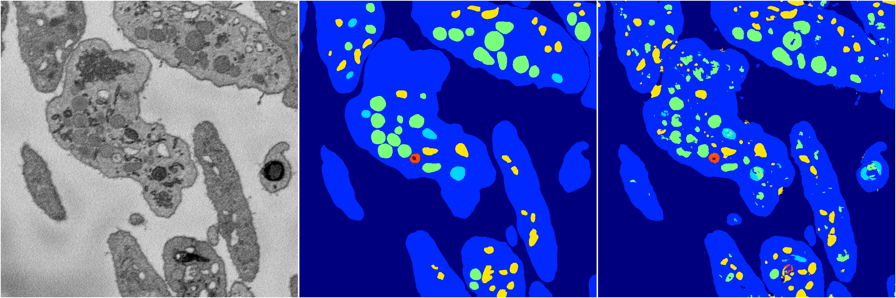

[Back](..)&nbsp;&nbsp;&nbsp;&nbsp;&nbsp;[Home](https://leapmanlab.github.io/snapshots)

---

<a href="0"><h2>random_2d_ed_dense / 0410 / 56 / 0</h2></a>
Created 07 May 2019, 11:56:55

<i>Click for more details</i>

**ari**: 0.7912. **miou**: 0.5163. **accuracy**: 0.9126. **n_params**: 1232550.0000. 

---

<a href="1"><h2>random_2d_ed_dense / 0410 / 56 / 1</h2></a>
Created 07 May 2019, 11:56:55

<i>Click for more details</i>

**ari**: 0.7799. **miou**: 0.5251. **accuracy**: 0.9109. **n_params**: 1232550.0000. 

---

[Back](..)&nbsp;&nbsp;&nbsp;&nbsp;&nbsp;[Home](https://leapmanlab.github.io/snapshots)

---