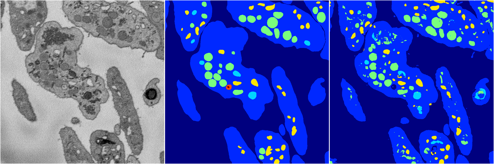

[Back](..)&nbsp;&nbsp;&nbsp;&nbsp;&nbsp;[Home](https://leapmanlab.github.io/snapshots)

---

<a href="1"><h2>random_2d_ed_dense / 0410 / 72 / 1</h2></a>
Created 16 Apr 2019, 17:08:26

<i>Click for more details</i>

**ari**: 0.8184. **miou**: 0.4828. **accuracy**: 0.9320. **n_params**: 11713083.0000. 

---

<a href="0"><h2>random_2d_ed_dense / 0410 / 72 / 0</h2></a>
Created 16 Apr 2019, 17:08:26

<i>Click for more details</i>

**ari**: 0.8056. **miou**: 0.4557. **accuracy**: 0.9259. **n_params**: 11713083.0000. 

---

[Back](..)&nbsp;&nbsp;&nbsp;&nbsp;&nbsp;[Home](https://leapmanlab.github.io/snapshots)

---