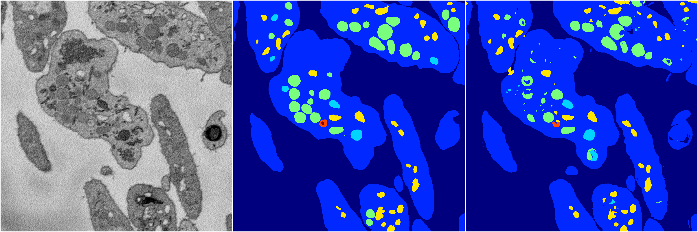

[Back](..)&nbsp;&nbsp;&nbsp;&nbsp;&nbsp;[Home](https://leapmanlab.github.io/snapshots)

---

<a href="1"><h2>random_2d_ed_dense / 0410 / 73 / 1</h2></a>
Created 07 May 2019, 11:56:56

<i>Click for more details</i>

**ari**: 0.8252. **miou**: 0.5290. **accuracy**: 0.9357. **n_params**: 19969413.0000. 

---

<a href="0"><h2>random_2d_ed_dense / 0410 / 73 / 0</h2></a>
Created 07 May 2019, 11:56:56

<i>Click for more details</i>

**ari**: 0.8254. **miou**: 0.5295. **accuracy**: 0.9366. **n_params**: 19969413.0000. 

---

[Back](..)&nbsp;&nbsp;&nbsp;&nbsp;&nbsp;[Home](https://leapmanlab.github.io/snapshots)

---